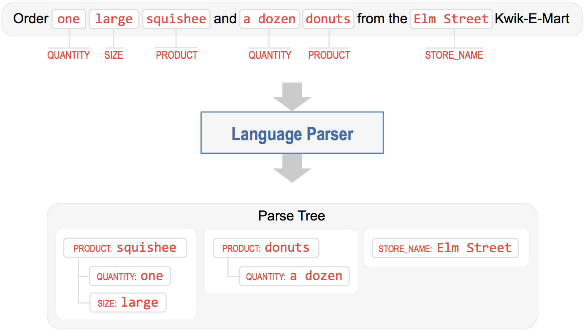

Step 8: Configure the Language Parser
=====================================

The language parser is the final component of the natural language processor. It is invoked after the other NLP models have been evaluated. Its job is to find relationships between the extracted entities and group them into a meaningful hierarchy. The parser analyzes the information provided by all the previous NLP models and outputs a data structure called the 'parse tree', which captures how different entities relate to each other. 

Consider the use case where you not only want to check the hours of your local Kwik-E-Mart, but also order items to pick up from the store in advance. To handle this functionality, we could define an entity type called ``product`` which specifies the name of an item you want to order. We could also define other entities such as ``size`` and ``quantity`` which provide more information about the items in your order. The language parser takes these entities, which are detected by the entity recognizer, and `parses <https://en.wikipedia.org/wiki/Parsing>`_ them into a representation which reflects a meaningful real-world organizational structure. This data structure can then be utilized to submit the order to a point-of-sale system, for example, to complete your order.

Consider the following sample query:

As illustrated, the language parser organizes detected entities into a collection of entity groups which comprise the parse tree. Each entity group has a main entity and possibly a collection of related child entities (or attributes) which further describe the parent entity. In linguistics, the main entity is called the `Head <https://en.wikipedia.org/wiki/Head_(linguistics)>`_ and the related entities are called `Dependents <https://en.wikipedia.org/wiki/Dependency_grammar>`_. 

The example query above contains three main pieces of information: the two products the user wants to order and the name of the store where they want place the order. Correspondingly, we have three entity groups, two of them with ``product`` entities as the head and one with a standalone ``store_name`` entity. The ``product`` entity has attributes like ``quantity`` and ``size`` that `modify <https://en.wikipedia.org/wiki/Grammatical_modifier>`_ it, and are hence grouped together with the head as its dependents.

`Natural language parsing <https://en.wikipedia.org/wiki/Natural_language_parsing>`_ is a long-studied problem in computer science and there are different approaches used, depending on the end goal and the depth of linguistic analysis required. The methods range from simple ones like rule-based and regex-based parsing to more sophisticated techniques like `syntactic parsing <http://spark-public.s3.amazonaws.com/nlp/slides/Parsing-Intro.pdf>`_ and `semantic parsing <https://web.stanford.edu/class/cs224u/materials/cs224u-2016-intro-semparse.pdf>`_. While parsing remains an active area of research, commercial applications like Siri, Cortana, Alexa and Google Assistant rely on approaches that work well in practice and are easy to build, debug and maintain. Such systems almost always leverage a good rule-based parser, optionally augmented by a statistical parser if enough human-annotated parsed data is available for training.

The language parser in Workbench is versatile enough to support everything from the simplest rule-based systems to state-of-the-art syntactic and semantic parsers. Out of the box, Workbench comes with a configuration-driven `dependency parser <http://spark-public.s3.amazonaws.com/nlp/slides/Parsing-Dependency.pdf>`_ (a kind of Syntactic Parser), similar to what's used in most commercial conversational applications today. 

Getting started with the parser merely requires specifying a parser configuration which defines the entity hierarchy in your application. For the simple example above, the parser config can be easily defined as follows.

.. code-block:: python

  >>> from mmworkbench import NaturalLanguageProcessor as Nlp
  >>> Nlp.parser.config({'product': ['quantity', 'size']})

Notice that the configuration simply specifies the typical entity hierarchy required in your application. With the parser, configured, you can now train your NLP models and then run the parser as follows.

.. code-block:: python
  
  >>> Nlp.build()
  >>> Nlp.parse('Order one large squishee and a dozen donuts from the Elm Street Kwik-E-Mart?')
  {
    ...
    'parse_tree': [
      {
        'id': 7628,
        'type': 'product',
        'name': 'squishee',
        'children': [
          'size': {'name': 'large', 'sku': 8128},
          'quantity': {'name': 'one', 'value': 1}
        ]
      },
      {
        'id': 15231,
        'type': 'product',
        'name': 'donut',
        'children': [
          'quantity': {'name': 'a dozen', 'value': 12}
        ]
      },
      {
        'id': 32109,
        'type': 'store_name',
        'name': 'Elm Street'
      }
    ]
    ...
  }

As you can see, the output of the parser will now include the :keyword:`parse_tree` data structure which captures the  relationship between entities detected in the query. If you are satisfied with this parser configuration, it can be saved to a file.

.. code-block:: python

  >>> Nlp.parser.dump()

To load a previously saved parser configuration, use the following.

.. code-block:: python

  >>> Nlp.parser.load()

The Workbench language parser is a versatile component which can be used to implement a variety of parsing strategies for your application. The :ref:`User Manual <userguide>` has more details on the different options available to fine-tune the behavior of the parser. It also covers how to define your own custom parsing logic and train a state-of-the-art statistical parser using annotated data.

The language parser completes the query understanding process by identifying the heads, their dependents and linking them together into a number of logical units (entity groups) that can be used by downstream components to take appropriate actions and generate the responses necessary to fulfill the user's request. However, it's worth mentioning that not every scenario may need the language parser. For instance, in our simple Kwik-E-Mart store information app, there are only two kinds of entities, ``date`` and ``store_name``, which are distinct and unrelated pieces of information. Thus, running the parser would just yield two singleton entity groups having heads, but no dependents. The parser becomes more crucial when you have an application that supports more complex natural language queries like the example we discussed above.
