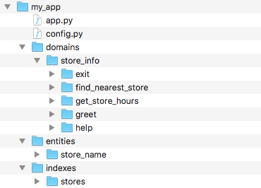
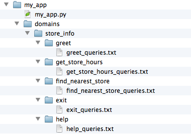
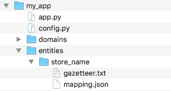
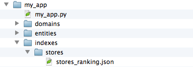

Generate Representative Training Data
=====================================

Supervised machine learning is the technology behind today's most successful and widely used conversational applications, and data sets are the fuel that power all supervised learning algorithms. For even simple applications, the combinatorial complexity of human language makes rule-based approaches intractable. Supervised machine learning, on the other hand, has proven remarkably effective at understanding human language by observing large amounts of representative training data. Most of the components in MindMeld Workbench rely on supervised machine learning algorithms that learn from thousands or millions of training examples.

It is important to remember that any supervised learning model is only as smart as its underlying training data. Therefore, generating comprehensive and representative training data is critical to ensure the success of any application. High-quality  data, also called 'labeled data', is not only the substrate upon which your models are built - it is also the yardstick used to measure performance. By standard practice, a portion of your labeled data always serves as the 'ground truth' used to score the 
accuracy of your underlying model. This 'ground truth' serves as the definitive benchmark to judge if one model is better than another. As you might imagine, this 'ground truth' only serves as a meaningful metric if it is derived from labeled data which accurately depicts desired application performance.

There are many different strategies for generating training data. The best approach depends on the stage and scope of your particular use case. For new applications that do not yet have any production traffic, training data sets are typically generated using manual data entry or crowdsourcing. In some cases, data sets can be derived by mining the web. For live applications with production traffic, data sets can sometimes be generated either from customer traffic logs or by instrumenting the application to collect user interaction signals. In all cases, multiple layers of quality assurance are typically required to ensure that the training data is high-quality, error-free and representative of desired application performance.

In MindMeld Workbench, there are 6 core supervised learning components that rely on training data. A given application may need  data for some or all of these components, depending on the use case.

  - Domain Classification
  - Intent Classification
  - Entity Recognition
  - Role Classification
  - Entity Resolution
  - Question Answerer Ranking

As described in :ref:`section 4 <define-hierarchy>`, the structure of your application's root directory in Workbench organizes the training data files that may be needed in your application. For our example application which provides Kwik-E-Mart store information, the application directory is shown below.

The training data for each component is stored in text files, and Workbench relies on the three different types of data files desribed below.

==================== ====
**Labeled Queries**  Labeled query files are text files containing example user queries. All labeled query files belong in the :keyword:`domains` folder. Each domain and intent subfolder should contain labeled query files that apply only to that intent. The hierarchical structure of the :keyword:`domains` folder provides the classification labels which are use to train the domain and intent classification models. Additionally, labeled query files also support an inline markup syntax for annotating entities and entity roles within each query. These annotations are used to train both the entity and role classification models.

**Entity Mappings**  Entity mappings are JSON files which can be used to associate whitelisted and blacklisted alternate names, or synonyms, with individual entities. These entities mappings belong in the :keyword:`entities` folder, and they are used to train the models required for entity resolution.

**Index Rankings**   Index rankings are JSON files which specify ranking scores which can be used to optimize question answering ranking performance. Each entry in an index ranking file specifies the ranking score associated with a query-object pair, for a given object in the question answering knowledge base. These files belong in the :keyword:`indexes` folder within the subdirectory named for the relevant knowledge base index.

==================== ====

We will now illustrate the typical structure for these three types of training data files.

Labeled Query Files
~~~~~~~~~~~~~~~~~~~

Labeled query files are the primary source of training data for the Workbench natural language processing classifiers. They are text files containing annotated example queries, one per line. Each file should contain queries which apply to only a single intent, and the labeled queries associated with each intent should be located in their corresponding subdirectory of the :keyword:`domains` folder. For our example Kwik-E-Mart application, the :keyword:`domains` directory could be organized as follows.

Note that since this application contains only a single domain, ``store_info``, a domain classifier is not necessary. If additional domains were present, we would need separate sets of training queries for each domain. By default, training data for each domain is derived from the union of all labeled queries available for each intent belonging to a given domain. For example, training queries for the ``store_information`` domain would consist of the union of all queries in the ``greet``, ``get_store_hours``, ``find_nearest_store``, ``exit`` and ``help`` intents. 

Since the ``store_info`` domain contains multiple intents, the labeled query text files will be used to train the intent classifier for this domain. The example queries in each individual file should illustrate the typical language patterns associated with each intent. For example, take a look at the :keyword:`greet_queries.txt` file:

.. code-block:: text

  Hello
  Good morning!
  How are you?
  greetings
  How's it going?
  What's up?
  ...

This file should capture many of the different ways you might expect your users to express a greeting. Similarly, lets take a look at the :keyword:`exit_queries.txt` file:

.. code-block:: text

  bye
  Good bye!
  See you later.
  quit
  sayonara
  ...

As you might expect, this data file captures many of the different ways a user might exit your application. Lets now take a look at the :keyword:`get_store_hours_queries.txt` file, which contains the labeled queries for the ``get_store_hours`` intent.

.. code-block:: text

  When does the {Elm Street|store_name} store close?
  What are the hours for the Kwik-E-Mart on {Main Street|store_name}?
  Is the {Central Plaza|name} Kwik-E-Mart open now?
  The store at {Pine & Market|store_name} - is it open?
  Is the {Rockerfeller|store_name} Kwik-E-Mart open for business {tomorrow|sys:date}?
  Can you check if the {Main St|store_name} store is open on {Sunday|sys:date}?
  ...

This file illustrates the annotation scheme for inline entities. As you might recall, from :ref:`section 4 <define-hierarchy>`, the ``get_store_hours`` intent supports the two entity types: ``store_name`` and ``date``.  As you can see in this example, each inline entity is appended by the pipe character followed by its associated entity type (e.g. :keyword:`|store_name`). The entire expression is then enclosed in curly braces, :keyword:`{Elm Street|store_name}`. You might also recall from :ref:`section 4 <define-hierarchy>` that certain entities, such as ``date``, are built-in or system-defined entities. As you can see in the snippet above, annotations for system entity names begin with :keyword:`sys:`. This simple annotation scheme provides a convenient way to label entities in order to derive the training data required to train the entity recognizer models.

Labeled queries can also be used to train role classification models. This is not a requirement for our Kwik-E-Mart application, but to illustrate how it might work, consider the following user query:

  * "Show me all Kwik-E-Mart stores open between 8am and 6pm."

Here, both :keyword:`8am` and :keyword:`6pm` could be defined as entities, perhaps of type :keyword:`sys:time`. While the two entities share the same type, they serve different 'roles' in the query; one reflects the store open time and the other is the store close time. Workbench provides the capability to train models to perform this role classification. Simply supplement your labeled queries with additional role annotation, as shown below.

.. code-block:: text

  Show me all Kwik-E-Mart stores open between {8am|sys:time|open_time} and {6pm|sys:time|close_time}.
  Are there any Kwik-E-Mart stores open after {3pm|sys:time|open_time}?
  ...

As you can see, the :keyword:`domains` directory hierarchy combined with the entity and role annotation scheme provides a convenient and efficient way to generate training data for the Workbench natural language processing models.

Entity Mapping Files
~~~~~~~~~~~~~~~~~~~~

Entity mapping files specify the training data required for entity resolution. Entity resolution is the task of maping each entity to a unique and unambiguous concept, such as a product with a specific ID or an attribute with a specific SKU number. In some cases, this mapping can be obvious. For example, the phrase 'Eiffel Tower' may always unambigously refer to famous Paris landmark. In most applications, however, there are often many variations different users express to describe the same object. For example, some people might call 'Bruce Springsteen' 'The Boss'. The word 'Tesla' might refer to the famous scientist or the electric car company. Customers ordering a 'diet cola', 'diet coke' or a 'diet tonic' might all expect to be served the same beverage. In Workbench, the entity resolver is responsible for identifying the unique and unambiguous concept associated with each entity.

Production conversational applications today rely on training data sets and supervised learning models to perform entity resolution. The training data utilized by Workbench for this purpose resides in entity mapping files located in the :keyword:`entities` folder of the application root directory.

In this example, the ``store_name`` entity has the mapping file :keyword:`store_name_mapping.json` shown below.

.. code-block:: javascript

  [
    {
      'id': '152323',
      'cname': 'Pine and Market',
      'whitelist': ['210 Pine Street', '210 Pine', 'Pine St']
    },
    {
      'id': '102843',
      'cname': 'Central Plaza',
      'whitelist': ['Central', 'Main Street Plaza', '100 Main Street', '100 Main']
    },
    {
      'id': '207492',
      'cname': 'Market Square',
      'whitelist': ['1 Market', '1 Market Square']
    },
    ...
  
  ]
  ...

As you can see in this code snippet, the entity mapping file specifies the unique object ``id`` associated with the entity as well as its canonical name, or ``cname``. In addition, the ``whitelist`` specifies one or more alternate names or synonyms which might be commonly used to refer to the same entity. Workbench relies on the data specified in this file in order to associate each natural language entity with a unique and unambiguous concept. Refer to the :ref:`User Manual <userguide>` for more details.

Index Ranking Files
~~~~~~~~~~~~~~~~~~~

Applications which rely on the Workbench question answering component can often benefit from additional training data which is used to optimize the ranking of its underlying knowledge base. These data files are called index ranking files, and they reside in the :keyword:`indexes` folder of the application root directory. The :keyword:`indexes` folder can optionally contain a subfolder for each knowledge base index used by the question answerer. If an index ranking file is available in each index subfolder, it will be used to optimize the knowledge base ranking. Consider the following sample directory structure.

In this example, the ``stores`` index has the ranking file :keyword:`stores_ranking.json` shown below.

.. code-block:: javascript

  [
    {
      'query': 'Kwik-E-Marts in Springfield',
      'id': '152323',
      'rank': 3
    },
    {
      'query': 'Kwik-E-Marts in Springfield',
      'id': '102843',
      'rank': 1
    },
    {
      'query': 'stores downtown',
      'id': '207492',
      'rank': 1
    },
    ...
  
  ]
  ...

As you can see, for each specified ``query``, the ranking file provides a way to identify the ideal ``rank`` for a knowledge base object specified by its unique ``id``. Refer to the :ref:`User Manual <userguide>` for more details on how to optimize the Workbench question answering performance.
