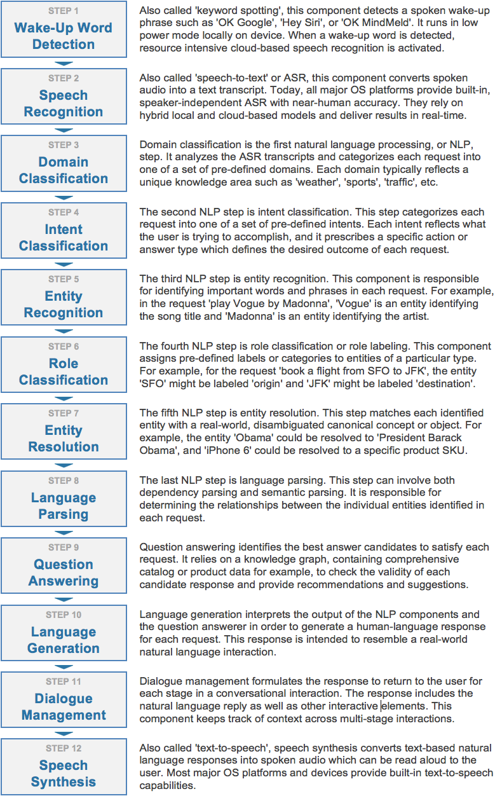

Introduction to Conversational Applications and MindMeld Workbench
==================================================================

Science fiction has long foretold a future where we routinely interact with applications and devices using natural human conversation. It has only been within the past few years, however, when this future has started to become a reality. Today, virtual assitants like Siri, Cortana, Google Assistant, and Alexa field many billions of voice and natural language queries every month. New voice-enabled devices like the Amazon Echo and Google Home reside in tens of millions of homes and represent one of the fastest-growing product categories of all time. Consumers worldwide increasingly expect that quick assistance and expert advice will be only a simple voice command or chat message away. They expect to invoke these services anywhere: in the office, at home, while driving, when on-the-go, and everywhere in between. Experts agree that we are entering a world where voice and chat assistants will be on-command to assist us with many of our daily tasks.

The Rise of the Conversational Interface
----------------------------------------

This remarkable transformation has surprised even the most jaded AI researchers. For nearly half-a-century, AI researchers have been laboring to build speech recognition and language understanding technology that could reach human levels of accuracy - to no avail. Long touted as the future of computing interfaces, these technologies have remained frustratingly out-of-reach for decades. This all began to change in the late 2000s and early 2010s. Fueled by massive amounts of data from exploding mobile internet usage, a long-studied discipline of machine learning called 'supervised learning' began to deliver surprisingly promising results. Long-standing AI research challenges such as speech recognition and machine translation began to see leaps in accuracy which dwarfed all improvements made over the previous decades combined.

.. image:: images/asr_accuracy.png

As a result of these advances in machine learning, virtual assistants, which had a notoriously hit-or-miss track record in their early years, started to see significant widespread adoption for the first time. This trend began in 2014 and 2015 and accelerated in 2016. To compound this trend, 2016 was also the year when every major consumer internet company launched open developer APIs on nearly every major platform which supports conversational interactions. This includes virtual assistant platforms like Google Assistant, Cortana and Siri as well as messaging platforms like Facebook Messenger, Skype, and Slack. It also includes the new generation of voice-enabled devices like Amazon Echo and Google Home. As a result, any company that is able to build a useful conversational interface can now reach potentially billions of new users across some of the most popular virtual assistant, messaging, and connected device platforms. For all of these new open platforms, human conversation is truly the *lingua franca*, and any organization which masters the ability to understand the natural language requests of their users will gain a huge strategic advantage in this emerging conversational application landscape.

Machine Learning and the Challenge of Building Useful Conversational Applications 
---------------------------------------------------------------------------------

Conversational applications may seem simple on the surface, but building truly useful conversational experiences represents one of the hardest AI challenges solvable today. The challenge lies in the inherent complexity of human language. Simple applications which support a very narrow vocabulary of commands are straightforward to build using rule-based approaches, but users nearly always find these simple applications trivial and tiresome. Applications to date that have succeeded in delighting users impose few constaints on a user's vocabulary; they simply let users speak to the application as if they are conversing with another human. Applications like this, which can understand broad-vocabulary natural language, are notoriously complex due to the inherent combinatorial complexity of language or what's also called the 'curse of dimensionality'. In other words, the number of different ways a human might phrase even a simple question can quickly explode into many thousands of variations. The human brain is remarkable at making sense of many trillions of language variations in a fraction of a second with near-perfect accuracy. This same feat is all but impossible for today's most advanced AI technology.

In the past few years, machine learning approaches, namely supervised learning and deep learning, have proven effective at understanding natural language in a wide range of broad-vocabulary domains. To date, large-scale supervised learning is the only approach that has yielded truly useful conversational applications which have been embraced by millions of users. All of today's most widely used conversational services, Cortana, Siri, Google Assistant, Alexa, rely on large-scale supervised learning. All supervised learning systems require two key ingredients: high-quality, representative training data and state-of-the-art algorithms. If the training data reflects the range of user inputs and outputs the application will experience during normal usage, then the algorithms can learn how to recognize the important patterns in the data which dictate how each request should be interpreted. 

It is important to remember that, for supervised learning, any application is only as smart as its underlying data. No machine learning technology exists today which is capable of demonstrating intelligence that is not already reflected in its underlying training data. To build a useful conversational application, it must first be possible and practical to collect training data that comprehensively illustrates the desired usage behavior. For applications where representative training data is abundant, advanced multi-layered neural network techniques like Deep Learning can likely be enlisted to give impressive results. For applications with modest amounts of data, a range of conventional machine learning techniques can likely be employed to deliver acceptable performance.

For language understanding applications, thousands or millions of training examples are typically required in order to illuminate the large number of language permutations which appear in actual user natural language requests. Each different domain generally requires its own different set of representative training data. While AI futurists envision that some day general purpose or 'strong' AI may enable broad vocabulary language understanding out-of-the-box without requiring domain-by-domain training, today's most effective AI requires different data for each different application domain.

Introducing MindMeld Workbench 
------------------------------

Large-scale supervised learning, when applied effectively, can be used to build very useful and versatile conversational applications. Unfortunately, the vast majority of attempts fail. Over the past few years, most companies which have attempted to build conversational applications have been unsuccessful in creating reliable or useful experiences. This woeful track record can no doubt be traced to the dearth of tools and best practices available to guide companies down the path toward success. This guide and the MindMeld platform was created to enable every company with the tools and techniques required to build highly useful and versatile conversational applications. The MindMeld platform is one of the most advanced AI platforms available today for building and deploying production-quality conversational experiences. This guide provides detailed instructions, best practices and reference applications which will enable any organization to create some of the most advanced conversational applications possible today. 

This guide relies on MindMeld Workbench to illustrate the standard approaches and best practices for creating conversational applications. MindMeld Workbench is a Python-based machine learning toolkit which was created to enable companies and developers to build state-of-the-art, production-quality conversational applications. In this guide, you will learn how to leverage Workbench to 

  - define and scope the the right use case
  - collect and maintain representative sets of training data
  - implement and analyze advanced natural language processing models
  - create a custom knowledge graph
  - build a question answering system
  - define a set of dialogue handlers
  - deploy your conversational application at scale

Different Approaches for Building Conversational Applications
=============================================================

Developers and researchers have been building conversational applications, such as chatbots, for decades. Over the years, many different strategies have been considered. With the recent proliferation and widespread adoption of voice and chat assistants, standard approaches are finally emerging to help define the best practices for building useful, production-quality chatbots. This section outlines a few of the most common approaches for building conversational applications today and describes some of the pros and cons associated with each.

Rule-Based Approaches
---------------------
Prior to the machine learning advances of the past decade, rule-based approaches were the most common strategy employed to build conversational applications. For developers unfamiliar with machine learning, rule-based logic is usually where most implementations begin. Today, there are several rule-based software frameworks, such as `BotKit <https://github.com/howdyai/botkit>`_ or `Microsoft Bot Framework <https://dev.botframework.com/>`_ which can assist developers in getting a simple conversational service up and running. The purpose of these frameworks is to provide the scaffolding to host message-handling logic and the plumbing to integrate with various bot client endpoints. These frameworks can simplify the task of setting up a server process which can listen for incoming text messages, and they can streamline the effort required to integrate with popular clients like Slack or Facebook Messenger.

With rule-based frameworks, the developer is responsible for implementing the core logic to interpret incoming messages and return helpful responses. This logic generally consists of a series of rules that specify which scripted response to return for a message that matches a specified pattern. Since rule-based frameworks are not intended to provide AI capabilities to parse or classify incoming messages, the developer must hardcode all of the necessary message processing and interaction logic. It is not uncommon for even simple applications to require hundreds of rules to handle the different dialogue states in a typical conversational interface.

Rule-based approaches are often the quickest way to build and launch a basic demo of a voice or chat assistant. Moving from demo to production, however, almost always exposes a multitude of corner cases, each of which must be handled with different rules. Conflicts and redundancies between rules further complicate this undertaking. Even for simple applications, the growing list of rules can quickly become prohibitively complex. Seasoned developers, familiar with the pitfalls of rule-based approaches, typically opt for one of the more sophisticated approaches discussed below.

Cloud-Based NLP Services
------------------------
For more sophisticated and useful bots, rule-based approaches break down and machine learning is required.
Cloud-based NLP services are an easy way to train ML models on small sets of data. Unfortunately, to build a truly useful bot, you typically need much larger data sets than these Cloud-based tools are intended to handle.
Outline the pros and cons of api.ai, wit.ai, amazon lex, microsoft luis.

Machine-Learning Toolkits
-------------------------
General-purpose ML toolkits like TensorFlow and GraphLab are not well suited for building Conversational AI applications.  MindMeld is a better choice is you are looking to build an advanced voice or chat assistant.
Outline the pros and cons of tensorflow, graphlab, nltk, etc.

Conversational AI Platforms
---------------------------
Advantages of MindMeld:
MindMeld ensures that you always maintain ownership and control of the training data and models which power your application  
real, production applications require lots of training data, and MindMeld provides the necessary utilities and analytics to manage large training data sets
high-quality, representative training data is the most important thing to ensuring a good experience, and MindMeld provides necessary tools to collect and QA training data via crowdsourcing
MindMeld is the only platform available today which provides a complete question answering and dialogue management system along with advanced natural language parsing capabilities
MindMeld's knowledge-driven learning approach is ideally suited for domains which involve a large product or content catalog
unlike UI-based NLP tools which are often too rigid to accommodate the functionality required in your application, MindMeld's flexible and powerful architecture can accommodate just about any application

Anatomy of a Conversational AI Interaction
==========================================

Hundreds of millions of people around the world use conversational assistants every single day. They invoke these assistants on their smartphone, on their laptop, in their car, using a connected device, or within many different applications. Some of these conversational assistants are voice-enabled and can listen to and respond in spoken language. Others are text-based and can read and respond to typed messages and requests. No matter the medium, application or device, all conversational interfaces rely on a set of core underlying technologies in order to understand natural language input and engage in a human-like conversational interaction. The diagram below illustrates the key technology steps which underlie modern conversational applications.

Depending on your application, some or all of these steps may be required. For example, if you are building a chat assistant for a messaging platform such as Facebook Messenger, the input and output are text rather than voice. In this case, steps 1, 2 and 12 are not required. If you are building an application which only performs simple actions and does not require answering questions, then step 9, question answering, may not be necessary. If your intention is to build a voice assistant that demonstrates the same level of accuracy and versatility as products like Siri, Alexa and Cortana, then all of the 12 components identified above are likely required. 

How to Know if Your Application is Ready for Launch
=====================================================

When is an application ready for deployment. You can only tell by using large-scale analytics to measure across the long tail of user interactions.

Building a conversational interface seems simple on the surface, but getting it right is one of the hardest AI challenges solvable today.  The production requirements for conversational interfaces are atypical of mobile or web apps:
they need to have near-perfect accuracy: apps will be effectively unusable until the reach a threshold of 95% accuracy or better
they require large amounts of training data: Small data sets beget trivially simple or brittle functionality. Users are unforgiving when behavior is less than human-like.
they require large-scale machine learning: Large data sets mandate large-scale ML techniques. This is the only approach proven to work in commercial apps.
they require careful management of user expectations: Without a guiding visual UI, users are often at a loss for words. The best use cases mimic a familiar, real-world interaction.
Conversational interfaces are binary. They are either useful or useless. There is rarely any middle ground. 

