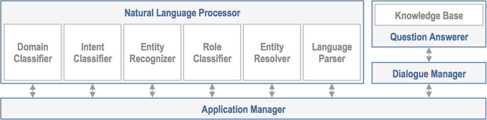

Introduction to Conversational Applications and MindMeld Workbench
==================================================================

Science fiction has long foretold a future where we routinely interact with applications and devices using natural human conversation. It has only been within the past few years, however, when this future has started to become a reality. Today, virtual assitants like Siri, Cortana, Google Assistant, and Alexa field many billions of voice and natural language queries every month. New voice-enabled devices like the Amazon Echo and Google Home reside in tens of millions of homes and represent one of the fastest-growing product categories of all time. Consumers worldwide increasingly expect that quick assistance and expert advice will be only a simple voice command or chat message away. They expect to invoke these services anywhere: in the office, at home, while driving, when on-the-go, and everywhere in between. Experts agree that we are entering a world where voice and chat assistants will be on-command to assist us with many of our daily tasks.

The Rise of the Conversational Interface
----------------------------------------

This remarkable transformation has surprised even the most jaded AI researchers. For nearly half-a-century, AI researchers have been laboring to build speech recognition and language understanding technology that could reach human levels of accuracy - to no avail. Long touted as the future of computing interfaces, these technologies have remained frustratingly out-of-reach for decades. This all began to change in the late 2000s and early 2010s. Fueled by massive amounts of data from exploding mobile internet usage, a long-studied discipline of machine learning called 'supervised learning' began to deliver surprisingly promising results. Long-standing AI research challenges such as speech recognition and machine translation began to see leaps in accuracy which dwarfed all improvements made over the previous decades combined.

.. image:: images/asr_accuracy.png

As a result of these advances in machine learning, virtual assistants, which had a notoriously hit-or-miss track record in their early years, started to see significant widespread adoption for the first time. This trend began in 2014 and 2015 and accelerated in 2016. To compound this trend, 2016 was also the year when every major consumer internet company launched open developer APIs on nearly every major platform which supports conversational interactions. This includes virtual assistant platforms like Google Assistant, Cortana and Siri as well as messaging platforms like Facebook Messenger, Skype, and Slack. It also includes the new generation of voice-enabled devices like Amazon Echo and Google Home. As a result, any company that is able to build a useful conversational interface can now reach potentially billions of new users across some of the most popular virtual assistant, messaging, and connected device platforms. For all of these new open platforms, human conversation is truly the *lingua franca*, and any organization which masters the ability to understand the natural language requests of their users will gain a huge strategic advantage in this emerging conversational application landscape.

Machine Learning and the Challenge of Building Useful Conversational Applications 
---------------------------------------------------------------------------------

Conversational applications may seem simple on the surface, but building truly useful conversational experiences represents one of the hardest AI challenges solvable today. The challenge lies in the inherent complexity of human language. Simple applications which support a very narrow vocabulary of commands are straightforward to build using rule-based approaches, but users nearly always find these simple applications trivial and tiresome. Applications to date that have succeeded in delighting users impose few constaints on a user's vocabulary; they simply let users speak to the application as if they are conversing with another human. Applications like this, which can understand broad-vocabulary natural language, are notoriously complex due to the inherent combinatorial complexity of language or what's also called the 'curse of dimensionality'. In other words, the number of different ways a human might phrase even a simple question can quickly explode into many thousands of variations. The human brain is remarkable at making sense of many trillions of language variations in a fraction of a second with near-perfect accuracy. This same feat is all but impossible for today's most advanced AI technology.

In the past few years, machine learning approaches, namely supervised learning and deep learning, have proven effective at understanding natural language in a wide range of broad-vocabulary domains. To date, large-scale supervised learning is the only approach that has yielded truly useful conversational applications which have been embraced by millions of users. All of today's most widely used conversational services, Cortana, Siri, Google Assistant, Alexa, rely on large-scale supervised learning. All supervised learning systems require two key ingredients: high-quality, representative training data and state-of-the-art algorithms. If the training data reflects the range of user inputs and outputs the application will experience during normal usage, then the algorithms can learn how to recognize the important patterns in the data which dictate how each request should be interpreted. 

It is important to remember that, for supervised learning, any application is only as smart as its underlying data. No machine learning technology exists today which is capable of demonstrating intelligence that is not already reflected in its underlying training data. To build a useful conversational application, it must first be possible and practical to collect training data that comprehensively illustrates the desired usage behavior. For applications where representative training data is abundant, advanced multi-layered neural network techniques like Deep Learning can likely be enlisted to give impressive results. For applications with modest amounts of data, a range of conventional machine learning techniques can likely be employed to deliver acceptable performance.

For language understanding applications, thousands or millions of training examples are typically required in order to illuminate the large number of language permutations which appear in actual user natural language requests. Each different domain generally requires its own different set of representative training data. While AI futurists envision that some day general purpose or 'strong' AI may enable broad vocabulary language understanding out-of-the-box without requiring domain-by-domain training, today's most effective AI requires different data for each different application domain.

Different Approaches for Building Conversational Applications
=============================================================

Developers and researchers have been building conversational applications, such as chatbots, for decades. Over the years, many different strategies have been considered. With the recent proliferation and widespread adoption of voice and chat assistants, standard approaches are finally emerging to help define the best practices for building useful, production-quality chatbots. This section outlines a few of the most common approaches for building conversational applications today and describes some of the pros and cons associated with each.

Rule-Based Approaches
---------------------
Prior to the machine learning advances of the past decade, rule-based approaches were the most common strategy employed to build conversational applications. For developers unfamiliar with machine learning, rule-based logic is usually where most implementations begin. Today, there are several rule-based software frameworks, such as `BotKit <https://github.com/howdyai/botkit>`_ or `Microsoft Bot Framework <https://dev.botframework.com/>`_ which can assist developers in getting a simple conversational service up and running. The purpose of these frameworks is to provide the scaffolding to host message-handling logic and the plumbing to integrate with various bot client endpoints. These frameworks can simplify the task of setting up a server process which can listen for incoming text messages, and they can streamline the effort required to integrate with popular clients like Slack or Facebook Messenger.

With rule-based frameworks, the developer is responsible for implementing the core logic to interpret incoming messages and return helpful responses. This logic generally consists of a series of rules that specify which scripted response to return for a message that matches a specified pattern. Since rule-based frameworks are not intended to provide AI capabilities to parse or classify incoming messages, the developer must code all of the necessary message processing and interaction logic by hand. It is not uncommon for even simple applications to require hundreds of rules to handle the different dialogue states in a typical conversational interface.

Rule-based approaches are often the quickest way to build and launch a basic demo of a voice or chat assistant. Moving from demo to production, however, almost always exposes a multitude of corner cases, each of which must be handled with different rules. Conflicts and redundancies between rules further complicate this undertaking. Even for simple applications, the growing list of rules can quickly become prohibitively complex. Seasoned developers, familiar with the pitfalls of rule-based approaches, typically opt for one of the more sophisticated approaches discussed below.

Cloud-Based NLP Services
------------------------
In the past few years, a variety of cloud-based NLP, or Natural Language Processing, services have emerged that aspire to reduce the complexity associated with building basic language understanding capabilities. These services are intended to enable developers without machine learning or NLP expertise to create useful NLP capabilities. All of these services provide browser-based consoles which assist developers in uploading and annotating training examples. They also streamline the task of launching a cloud-based web service to handle and parse natural language requests. These services are generally provided by large consumer internet companies to entice developers to upload their training data and thereby help the service provider improve their own conversational AI offerings in the process. Some of the NLP services currently available include `Amazon Lex <https://aws.amazon.com/lex/>`_, `Google's api.ai <https://api.ai/>`_, `Facebook's wit.ai <https://wit.ai/>`_, `Microsoft LUIS <https://www.luis.ai/>`_,  `Samsung's Viv <http://viv.ai/>`_, `IBM Watson Conversation <http://www.ibm.com/watson/developercloud/conversation.html>`_, among others.

Cloud-based NLP services offer a relatively straighforward path for developers to build conversational applications without requiring machine learning knowledge. As a result, they can be the fastest path for assembling a demo or prototype. Many of these services offer pre-trained models for popular consumer tasks like checking the weather, setting an alarm or timer, updating a to-do list or sending a text message. Consequently, these NLP services are well-suited for applications which simply need to replicate common consumer domains without customization. Since the pre-trained models generally offered by these services duplicate the freely available functionality in today's widely used consumer virtual assistants, companies interested in leveraging these pre-trained models to monetize their own business will likely face an uphill battle.

For companies that need to build an application which goes beyond a simple demo and requires models other than the generic, pre-trained consumer domains, cloud-based NLP services are typically not the best approach. Building language understanding models tailored to a particular application or domain requires training the models on thousands or millions of representative training examples. Cloud-based NLP services, since they are targeted at developers who are unlikely to have large amounts of training data, are generally intended for smaller data sets and simpler custom models. In addition, most cloud-based NLP services only provide basic support for NLP tasks such as intent classification and entity recognition. Implementing the other required processing steps in a typical conversational workflow, such as entity resolution, language parsing, question answering, and knowledge base creation, is left up to the developer. Perhaps most importantly, for companies that are unable or unwilling to forego legal ownership of user data when it is uploaded to the service provider cloud, these NLP services are generally not a viable option. 

Machine Learning Toolkits
-------------------------
Machine learning researchers working on NLP and conversational applications typically rely on versatile and advanced machine learning tookits. These toolkits provide low-level access to state-of-the-art algorithms including Deep Learning techniques like LSTMs, RNNs, CNNs and more. Some of the more popular machine learning toolkits in use today include `Google's TensorFlow <https://www.tensorflow.org/>`_, `Microsoft Cognitive Toolkit <https://www.microsoft.com/en-us/research/product/cognitive-toolkit/>`_, and `Apple's GraphLab Create <https://turi.com/>`_, among others.

For machine learning researchers, toolkits like these are indispensable, and they serve as the foundation for much of the cutting-edge AI research performed today. For companies looking to deploy production conversational services, however, these toolkits often provide little help. While machine learning toolkits provide access to the most advanced machine learning algorithms, they provide little or no representative training data that is likely useful for a given production application. As a result, developers must do all the heavy lifting associated with creating and managing training data themselves. Furthermore, while machine learning toolkits provide deep access to low-level machine learning algorithms, they do not offer any of the higher level abstractions which can greatly streamline the task of constructing a conversational interface. As a result, even the most skilled machine learning engineers will rarely succeed in building production-quality conversational applications using today's machine learning toolkits.

Conversational AI Platforms
---------------------------
With the rise of converational applications in the past few years, a new technology approach has emerged to assist companies and developers create production-quality conversational experiences. Today called Conversational AI Platforms, these solutions are machine learning platforms which have been optimized for the task of creating conversational applications such as voice or chat assistants. The platforms offer companies the flexibility and advanced capabilities of traditional machine learning toolkits but are specifically adapted to streamline the task of building  production conversational interfaces. `MindMeld Workbench <https://www.mindmeld.com/>`_ is an example of one of the most widely used Conversational AI platforms available today.

Conversational AI platforms differ from pure machine learning platforms in that they offer tools specifically designed for the machine learning steps in a typical conversational workflow. For example, tools for intent classification, entity recognition, entity resolution, question answering, dialogue management are common components in Conversational AI platforms. Conversational AI platforms differ from cloud-based NLP services in that they are intended to be used machine learning engineers with some familiarity of data science best practices. As a result, Conversational AI platforms offer more advanced tools and more flexibility to train and analyze custom language understanding models around large sets of training data. Unlike cloud-based NLP services, Conversational AI platforms do not require that training data be uploaded to a shared clould infrastructure. Instead, they provide a flexible and versatile platform which ensures that data sets and trained models are locally managed and always remain the intellectual property of the application developer.

How Good is Good Enough?
------------------------
With so many different approaches for building conversational applications, it is often difficult for companies to know which strategy is best. The best strategy should be the one that achieves the minimum threshold of performance which ensures a positive user experience. For conversational applications, determining this minimum level of acceptability can often be a confusing or daunting undertaking.

Conversational interfaces represent a new user interface paradigm that is unfamiliar and nonintuitive for many developers who have experience building web or native applications. Unlike traditional graphical user interfaces (GUIs), conversational interfaces can be much more unforgiving. In a traditional GUI, the visual elements on the display provide a very useful mechanism to guide a user down an interaction path that will lead to a positive experience. For conversational interfaces, no such visual guide exists. Instead, the user is typically presented with a microphone button or a text prompt, and they are expected to figure out how to verbalize their desired request from scratch. When faced with such an open-ended prompt and little context, many users find themselves at a loss for words. Even worse, they might pose a question that the system is not designed to handle, leading to a fruitless and frustrating outcome.

Developers who are building a conversational interface for the first time often attempt to follow the same practices utilized for traditional GUIs. Namely, a developer builds a minimum viable product, or MVP, which captures a small subset of the envisioned functionality, and then submits the MVP for user testing. For conversational interfaces, this approach almost inevitably fails. An minimal implementation of a conversational interface typically means that it will be built using a small subset of the training data that will eventually be needed in a production application. For example, consider an MVP built using 10% of the training data eventually required. This application will only be able to understand around ten percent of the typical language variations verbalized by users when they invoke your app. As a result, when you submit your app for user testing, nine out of ten users will fail on their first request. This abysmal performance might quickly toll the death knell for your project.

As it turns out, quick-and-dirty prototypes and limited-scale user testing are not particularly useful in assessing the utility of conversational applications. The only way that performance can be measured accurately is by enlisting large-scale analytics to deterministically measure performance across the long tail of possible user interactions. Popular commercial virtual assistants like Siri, Cortana, Google Assistant and Alexa all rely on this same measurment methodology to ensure that their services meet a mimimum threshold of acceptability before they launch any new features publicly. This measurement methodology first relies on having a large enough set of 'ground truth' training data to be sure that it reflects the lion's share of all possible user interaction patterns. Next this 'ground truth' data is used, via automated testing, to ensure that a large enough percentage of user queries return an acceptable response.

Users are unforgiving when evaluating a conversational interface. They expect to be able to verbalize their request the same way they would if speaking with another person. They also expect that the system will respond with human-like accuracy. This typically means that conversational applications must be near-perfect. In practice, this means that conversational interfaces must have an accuracy of at least 95%. Anything less, and users will like conclude your app is  dimwitted and never use it again.

Given these unique characteristics of conversational applications, it is important to remember the following guidelines to ensure your conversational interface can meet a minimum threshold of acceptability before going live.

  - Select a use case that mimics a familiar, real-world interaction so that users will have intuition about the types of questions they might ask. Selecting an unrealistic or incorrect use case will render even the smartest app dead on arrival.
  - Ensure that you have a large enough set of 'ground truth' training to ensure that the vast majority of user interactions can be captured and measured. Dipping your toe in the water does not work. Real-world accuracy can only be evaluated after you take the plunge.
  - Employ large-scale analytics to ensure that your application achieves at least 95% accuracy across the long tail of possible user interactions. Spot checking and small-scale user testing will be unable to expose long-tail corner cases which might fatally undermine overall accuracy.

Anatomy of a Conversational AI Interaction
==========================================

Hundreds of millions of people around the world use conversational assistants every single day. They invoke these assistants on their smartphone, on their laptop, in their car, using a connected device, or within many different applications. Some of these conversational assistants are voice-enabled and can listen to and respond in spoken language. Others are text-based and can read and respond to typed messages and requests. No matter the medium, application or device, all conversational interfaces rely on a set of core underlying technologies in order to understand natural language input and engage in a human-like conversational interaction. The diagram below illustrates the key technology steps which underlie modern conversational applications.

.. image:: images/anatomy.png

Depending on your application, some or all of these steps may be required. For example, if you are building a chat assistant for a messaging platform such as Facebook Messenger, the input and output are text rather than voice. In this case, steps 1, 2 and 12 are not required. If you are building an application which only performs simple actions and does not require answering questions, then step 9, question answering, may not be necessary. If your intention is to build a voice assistant that demonstrates the same level of accuracy and versatility as products like Siri, Alexa and Cortana, then all of the 12 components identified above are likely required. 

Introducing MindMeld Workbench 
==============================

Large-scale supervised learning, when applied effectively, can be used to build very useful and versatile conversational applications. Unfortunately, the vast majority of attempts fail. Over the past few years, most companies that have attempted to build conversational applications have been unsuccessful in creating reliable or useful experiences. This woeful track record can no doubt be traced to the dearth of tools and best practices available to guide companies down the path toward success. This guide and the MindMeld platform was created to enable every company with the tools and techniques required to build highly useful and versatile conversational applications. The MindMeld platform is one of the most advanced AI platforms available today for building and deploying production-quality conversational experiences. This guide provides detailed instructions, best practices and reference applications which will enable any organization to create some of the most advanced conversational applications possible today. 

This guide relies on MindMeld Workbench to illustrate the standard approaches and best practices for creating conversational applications. MindMeld Workbench is a Python-based machine learning toolkit which was created to enable companies and developers to build state-of-the-art, production-quality conversational applications. MindMeld is a commercial software package. If you are interested in licensing, go to here...

The MindMeld Approach
---------------------
MindMeld Workbench is a Conversational AI platform that was specifically designed to meet the needs of enterprises that want to build and deploy production-quality conversational applications. To date, it has been used for applications in dozens of different domains by some of the largest global organizations. Over the course of these many different production deployments, MindMeld Workbench has evolved to be ideally suited for building production-quality, large-vocabulary language understanding capabilities for any custom application domain.

MindMeld Workbench was architected around the following guiding principles:

- MindMeld ensures that you always maintain ownership and control of the training data and models which power your application  
- real, production applications require lots of training data, and MindMeld provides the necessary utilities and analytics to manage large training data sets
- high-quality, representative training data is the most important thing to ensuring a good experience, and MindMeld provides necessary tools to collect and QA training data via crowdsourcing
- MindMeld is the only platform available today which provides a complete question answering and dialogue management system along with advanced natural language parsing capabilities
- MindMeld's knowledge-driven learning approach is ideally suited for domains which involve a large product or content catalog
- unlike UI-based NLP tools which are often too rigid to accommodate the functionality required in your application, MindMeld's flexible and powerful architecture can accommodate just about any application

The Purpose of this Guide
-------------------------

In this guide, you will learn how to leverage Workbench to 

  - define and scope the the right use case
  - collect and maintain representative sets of training data
  - implement and analyze advanced natural language processing models
  - create a custom knowledge graph
  - build a question answering system
  - define a set of dialogue handlers
  - deploy your conversational application at scale

