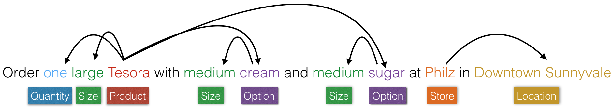
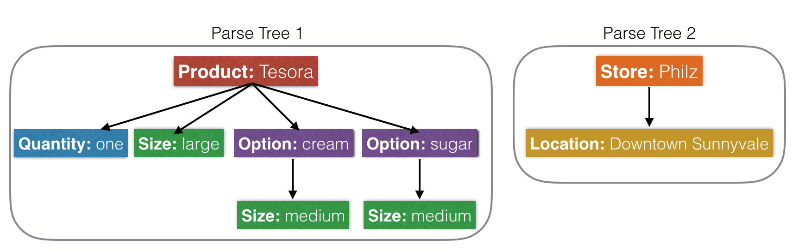

Language Parser
===============

What this component is trying to accomplish: Extract relations between the recognized entities and group them into logical entity groups, called parse trees.

Each parse tree has a main entity (Head) and a set of related attribute entities (Dependents).

[ Define Head and Dependents in more detail]

E.g. Here are relations between entities in a query represented in the form of a dependency graph:

The entity groups can also be represented as parse trees:

Our parser can be told to extract trees of this kind by providing a parser.config file that describes which entity types are the Heads, which ones are the Dependents, and which Dependents go with which Heads.

E.g. Parser configuration representing the above two parse trees: 

.. code-block:: text

	tree:
		name: 'product_info'
		head:
			type: 'product'
		dependent:
			type: 'quantity'
		dependent:
			type: 'size'
		dependent:
			tree:
				name: 'option_info'
				head:
					type: 'option'
				dependent:
					type: 'size'

	tree: 
		name:'store_info'
		head:
			type: 'store'
		dependent:
			type: 'location'

.. note::
 	- At a minimum, a name and a head are required to define a parse tree. You can optionally define dependents for the head.

 	- A dependent of a head entity can be a tree itself.

Defining your trees in the above format should generally be enough and the MindMeld Parser will do a reasonable job of parsing the input according to the given tree specifications. However, in some cases, you may want a more fine-grained control of the parsing settings. Below is the full set of properties you can optionally define in your parser.config file to fine-tune the parser behavior.

.. code-block:: text

	tree:
		name: '[TREE NAME]'
		head:
			type: '[EXPECTED HEAD ENTITY TYPE]'
			role: '[EXPECTED HEAD ENTITY ROLE]'
		dependent:
			type: '[EXPECTED MODIFIER ENTITY TYPE]'
			role: '[EXPECTED MODIFIER ENTITY ROLE]'
			left_attachment = [BOOLEAN]
			left_attachment_distance = [INTEGER]
			right_attachment = [BOOLEAN]
			right_attachment_distance = [INTEGER]
			minimum_instances = [INTEGER]
			maximum_instances = [INTEGER]
			precedence: ['left' or 'right']

Let's take a look at each of the settings one by one.

1. Tree

Every parse tree object you define in the config **must** have a name and a head entity type. It can optionally have any number of dependents that are related to the head.

.. code-block:: text

	tree:
		name:'[TREE NAME]'		# (Required) Name of the tree object
		head:				# (Required) Description of the head
			...
		dependent:			# Description of dependent 1 (can be a tree)
			...
		dependent:			# Description of dependent 2 (can be a tree)
			...

The head entity becomes the root of the parse tree and any specified dependents are attached as its children. The options you set while defining the head and dependents control the parsing behavior.

2. Head

Every head entity **must** define the entity type to match against. If your entities have roles assigned to them, you can optionally also specify the role to match against. If not specified, the parser will match against all role types by default.

.. code-block:: text

	head:
		type: '[EXPECTED TYPE]'			# (Required) Type of entity to match against
		role: '[EXPECTED ROLE]'			# Role of the entity to match against

3. Dependent

Similar to heads, each dependent entity **must** define the entity type to match against. You can optionally also specify the exact role to match against. If not specified, the parser will match against all role types by default.

.. code-block:: text

	dependent:
		type: '[EXPECTED TYPE]'			# (Required) Entity type to match against
		role: '[EXPECTED ROLE]'			# Entity role to match against

You can also additionally specify how many dependents of this entity type attach to the head. The parser, by default will link as many dependents as it can find and treat any missing ones as optional.

.. code-block:: text

	.	minimum_instances = [INTEGER]		# Minimum number necessary
	.	maximum_instances = [INTEGER]		# Maximum number allowed

You can control where the parser looks for dependents of a head entity: To its left, to its right or in both directions. You can also specify the number of tokens (a multi-token entity is treated as one token) between the dependent and the head. By default, the parser looks for dependents in both directions and searches till the beginning or the end of sentence.

.. code-block:: text

	.	left_attachment = [BOOLEAN]		# Accept dependent to the left
	.	left_attachment_distance = [INTEGER]	# Maximum distance to dependent
	.	right_attachment = [BOOLEAN]		# Accept dependent to the right
	.	right_attachment_distance = [INTEGER]	# Maximum distance to dependent

Finally, you can define whether to prefer attachments on left or right in cases where the parser is instructed to look on both sides of the head entity. This is used by the parser to break ties, in case it finds dependents on each side that are equidistant from the head. By default, the parser gives precedence to the dependent instance on the left.

.. code-block:: text

	.	precedence: ['left' or 'right']		# Preferred attachment direction

If the config-driven parser doesn't fully satisfy your use case or you need more flexibility in defining how the relations between entities should be extracted, Workbench provides the flexibility to drop in your own custom parsing logic. 

[ Describe how to do that by adding logic in my_app.py ]

