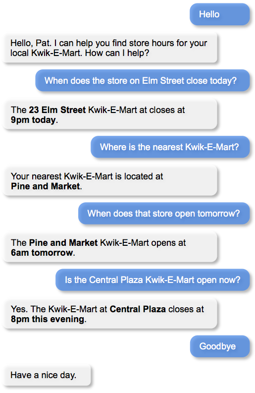
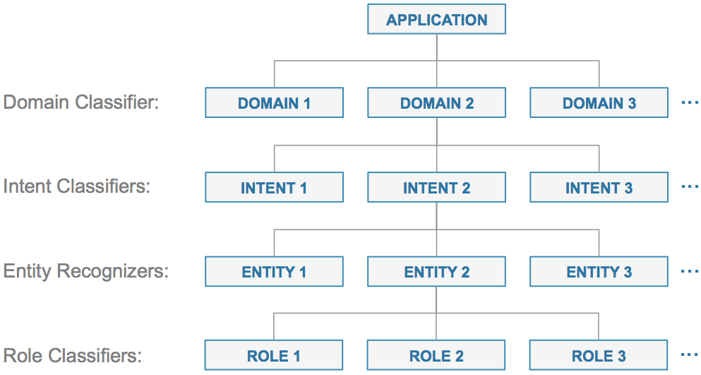
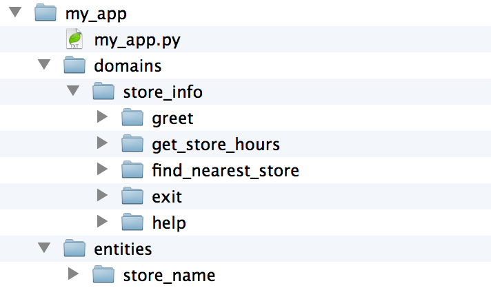
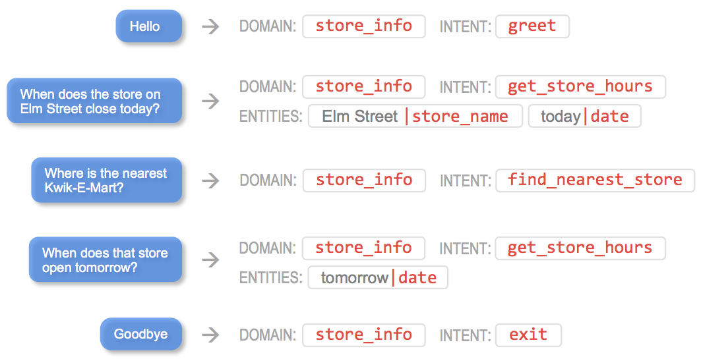
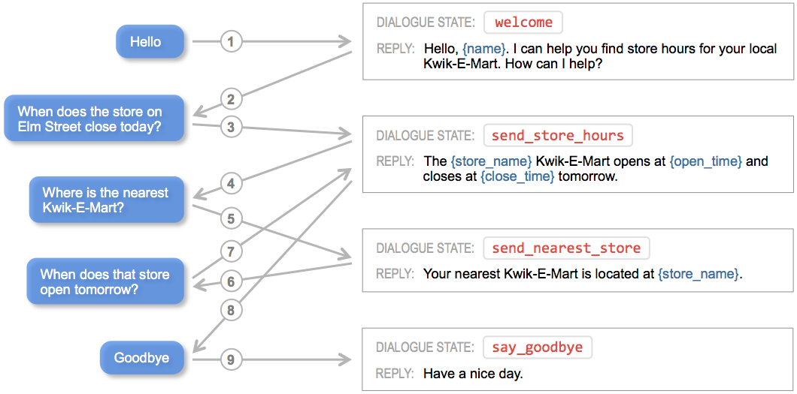
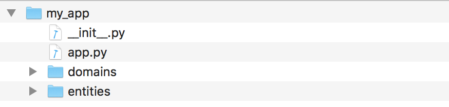
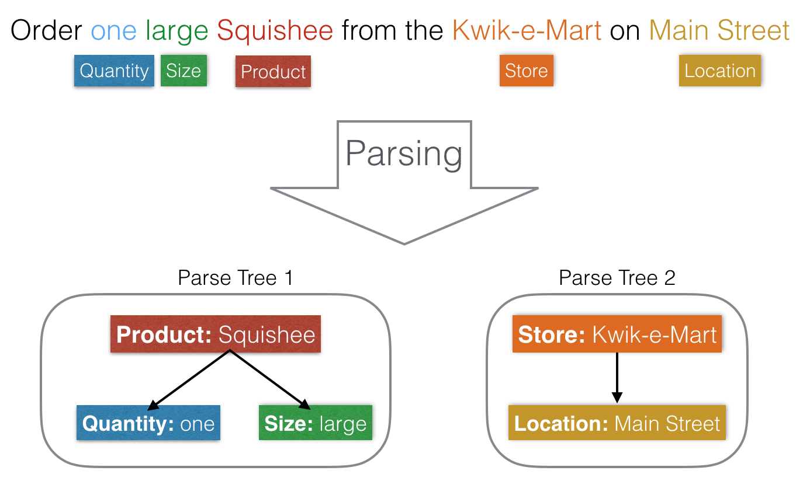
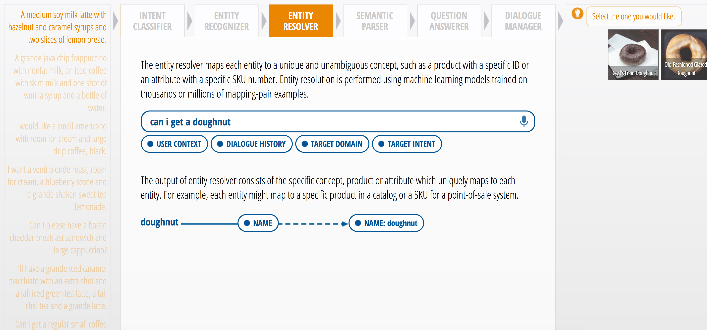

Building a Conversational Interface in 11 Steps
===============================================

Great conversational applications require both advanced technology as well as solid design judgement. The most widely used conversational applications today, such as Siri, Alexa, Google Assistant and Cortana, are all built using a similar set of techniques and technologies to ensure both high accuracy and utility. This section outlines the methodology that is used to build today's most advanced and useful conversational applications. Specifically, this section will walk through the steps that are required to build and deploy a conversational application for a simple use case. This simple example will highlight the key design steps and technology components which underpin any great conversational experience. Along the way, we will illustrate how MindMeld Workbench can be employed to streamline the task of building and deploying conversational interfaces. 

Taking a conversational application from conception to production typically involves the eleven implementation steps summarized below.

== ===
1  Select the right use case.
2  Script your ideal dialogue interactions.
3  Define the domain, intent, entity and role hierarchy.
4  Define the dialog state handlers.
5  Create the question answerer knowledge base.
6  Generate representative training data.
7  Train the natural language processing classifiers.
8  Train the entity resolvers.
9  Implement the language parser.
10 Optimize question answering performance.
11 Deploy trained models to production.
== ===

This section will illustrate each of these steps using an example of a simple conversational application.

Select the Right Use Case
-------------------------
Selecting the right use case is perhaps the most important step in building a conversational application that users will love. There are many use cases where a voice or chat conversation can simplify the task of finding information or accomplishing a task. There are also many use cases where a conversational interface can be inconvenient or frustrating. Selecting an unrealistic or incorrect use case will render even the smartest voice or chat assistant dead on arrival.

While there is no magic formula to determine which use case is ideal for a conversational interface, some best practices have begun to emerge to delineate good candidates from the bad. Before selecting a use case, it is important to ask the following questions to ensure that your conversational application will be practical to build and provide real value to users.

===================================================== ===
**Does it resemble a real-world human interaction?**  Conversational interfaces do not come with instruction manuals, and there is little opportunity to teach users about the supported functionality before they take it for a spin. The best use cases mimic an existing, familiar real-world human interaction so that users intuitively know what they can ask and how the service can help. For example, a conversational interface could mimic an interaction with a bank teller, a barista or a customer support rep.

**Does it save users time?**                          Conversational interfaces shine when they save users time. A conversational interface will be viewed as an unwelcome impediment when a well-designed GUI would be faster. The most useful conversational experiences often center around a use case where users are looking to accomplish a specific task and know how to articulate it. For example, simply saying 'play my jazz music playlist in the kitchen' can be much faster than launching an app and navigating to the equivalent option by touch.

**Is it more convenient for the user?**               Voice interfaces can be particularly useful when users' hands and attention are occupied or if a mobile device is not within reach. If you expect users will often enlist your application while driving, biking, walking, exercising, cooking or sitting on the couch, it is likely an excellent candidate for a conversational interface.

**Does it hit the Goldilocks zone?**                  The best conversational applications fall squarely into the 'Goldilocks zone'. They offer a range of functionality that is narrow enough to ensure the machine learning models have high accuracy. At the same time, they have functionality that is broad enough to ensure that users find the experience useful for a wide variety of tasks. Apps that are too narrow can be trivial and useless. Apps that are too broad can have hit-or-miss accuracy which can frustrate users.

**Is it possible to get enough training data?**       Even the best use cases will fail if it is not possible or practical to collect enough training data to illustrate the complete range of envisioned functionality. For ideal use cases, training data can be easily generated from production traffic or crowdsourcing techniques. If training data for your use case can only be sourced from a small number of hard-to-find human experts, it is likely not a good candidate for a conversational interface.
===================================================== ===

For this quickstart section, we will consider a simple conversational use case which can provide information about retail store locations for your neighborhood Kwik-E-Mart. For example, you could use this service to ask about store hours: 'When does the Kwik-E-Mart on Elm street close today?'. This rudimentary use case will serve as a reference example to highlight the key steps in building a useful conversational interface.

.. _script-interactions:

Script Your Ideal Dialogue Interactions
---------------------------------------

Once you have identified a good use case, the next step is to script your envisioned dialogue interactions. This design exercise details the conversational interaction flows which define the user experience for your application. It is important to think through not just the most obvious user flows, but also the corner case and exception user flows which may be encountered by users during an interaction. For example, the dialogue flows should illustrate how the application responds if the user request is beyond the application scope. Also, the flows should illustrate the interactions which will enable users to gracefully leave the interaction or to get help if they are stuck. The dialogue flows should detail not only the various interaction pathways a conversation may traverse, but they should also illustrate the desired language and tone envisioned for the experience.

For developers familiar with graphical interface design, this step is comparable to the task of creating wireframes and pixel-perfect mockups. Like any design step, there will likely be many iterations required to work through usability issues and reach consensus on a final design. It is always wise to begin coding and implementation only after the dust has settled on the scripted dialogue interactions. Otherwise, much implementation work and effort may be wasted. 

For our simple use case, the following diagram illustrates the dialogue interactions we will strive to deliver in our final implementation.

Define the Domain, Intent, Entity and Role Hierarchy
-------------------------------------------------------

Conversational applications rely on a hierarchy of machine learning classifiers in order to model and understand natural language. More broadly defined as Natural Language Processing, this family of machine learning models sits at the core all conversational assistants in widespread production use today. While there are many different ways that machine learning techniques can be enlisted to dissect and understand human language, a set of best practices has been adopted in recent years to systematize the sometimes challenging task of building accurate and useful natural language processing systems. Today, nearly all commercial conversational applications rely on the hierarchy of machine learning models illustrated below.

The topmost layer in the model hierarchy is the domain classifier. The domain classifier is responsible for performing a first-pass classification to assign incoming queries into set of pre-defined buckets or 'domains'. For any given domain, there may be one or more pre-defined intents. Each intent defines a specific action or answer type to invoke for a given request. The intent classifier models are responsible for deciding which intent is most likely associated with a given request. Once the request is categorized into a specific intent, the entity recognition models are employed to discern the important words and phrases in each query that must be identified in order to understand and fulfill the request. These identified words and phrases are called 'entities', and each intent may have zero or more types of entities which must be recognized. For some types of entities, a fourth and final classification step, called role classification, may be required. The role classifiers are responsible for adding differentiating labels to entities of the same type. Refer to the :ref:`User Guide <userguide>` for a more in-depth treatment of the natural language processing classifier hierarchy utilized by MindMeld Workbench. 

For our simple conversational application which can help us find store information for our local Kwik-E-Mart, the natural language processing model hierarchy can be designed as illustrated below.

.. image:: images/hierarchy2.png
    :width: 700px
    :align: center

As illustrated, this rudimentary application has a single domain, 'store_info', which encompasses all of the functionality required to find information about Kwik-E-Mart retail stores. In addition, this domain supports five initial intents:

   - ``greet`` Begins an interaction and welcomes the user.
   - ``get_store_hours`` Returns the open and close time for the specified store.
   - ``find_nearest_store`` Returns the closest store to the user.
   - ``exit`` Ends the current interaction.
   - ``help`` Provides help information in case the user gets stuck.

.. note::

  By convention, intent names should always be verbs which describe what the user is trying accomplish.

In this basic example, only the ``get_store_hours`` intent requires entity recognition. This intent supports the two defined entity types listed below.

   - ``store_name`` The name of a specific retail store location.
   - ``date`` The calendar date or day of the week.

Neither of these two entity types will require role classification in this simple example.

.. note::

  By convention, entity names should always be nouns which describe the entity type.

The design of the domain, intent, entity and role hierarchy for this example application is now complete, and we can begin implementing this application using MindMeld Workbench. Every Workbench application begins with a root folder. The root folder contains all of the training data files, configuration files and custom code required in each Workbench application. For our simple example, lets first define a root directory called 'my_app'. To define the domain and intent hierarchy for your application, create a subfolder called 'domains'. Inside the 'domains' folder, create a subfolder for the name of each different domain in your application. Then, inside each domain folder, create another subfolder with the name of each individual intent in that domain. These folders are used to organize the training data for your machine learning models to understand natural language.

Similarly, inside the root folder, create another subdirectory called 'entities'. Inside the entities folder, create a subdirectory for the name of every different entity type required in your application. These folders organize the data files used by the entity recognizer, role classifier and entity resolver models. Refer to the :ref:`User Guide <userguide>` for more details about the organization and structure of the application root directory. The :ref:`User Guide <userguide>` also describes application 'blueprints' which provide pre-configured application directory structures for common conversational application use cases.

For our simple example application, the root directory structure which implements our desired natural language model hierarchy is illustrated below. 

Notice that there is no folder for the ``date`` entity. In this case, ``date`` is a 'system' entity, which is already built in to the Workbench platform. Workbench provides several different 'system' entity types for common, domain-independent entities; see the Workbench :ref:`User Guide <userguide>` for details.  

Given this defined hierarchy, we would expect our trained natural language processing models to yield the following results for the user requests in the simple interaction proposed in the preceding section.

The following sections of the quickstart will describe how to introduce training data to the defined directories in order to build machine learning models to parse and understand user requests, as shown above.

Define the Dialogue State Handlers
-----------------------------------

Today's commercial voice and chat assistants guide users through a conversational interaction in order to find information or accomplish a task. The steps in each conversational interaction are called 'dialogue states'. A dialogue state defines the form of response which is appropriate for each step in an interaction as well as other logic that must be invoked to determine the desired response. Each application relies on a set of dialogue state handlers which define the logic and response required for every supported dialogue state. 

At the core of every conversational application resides a dialogue manager. The dialogue manager is responsible for analyzing each incoming request and assigning it to a specific dialogue state handler to execute required logic and return a response. The task of mapping each incoming request to the appropriate dialogue state is often referred to as 'dialogue state tracking'. While applying large-scale machine learning techiniques for dialogue state tracking is an active area of research today, nearly all commercial applications rely heavily on rule-based and pattern-matching approaches to map incoming requests to the correct dialogue state.

MindMeld Workbench provides advanced and flexible capabilities for dialogue state tracking. It offers a flexible syntax for defining the rules and patterns each incoming request must match in order to be assigned to a specific dialogue state. In addition, Workbench is fully extensible and can accommodate any custom logic to supplement MindMeld's built-in pattern matching capabilities.

Specify the Superset of Dialogue States
~~~~~~~~~~~~~~~~~~~~~~~~~~~~~~~~~~~~~~~

Before you can begin implementing your dialogue state handlers, it is first necessary to define the required dialogue states. For simple conversational interactions, the set of dialogue states can be very straightforward, as illustrated in the flow diagram below.

.. image:: images/simple_dialogue_states.png
    :width: 700px
    :align: center

In practice, however, the flow of dialogue states can be quite complex. Conversational applications are powerful since they provide few constraints on what a user can say during an interaction. This makes it easy for a user to shortcut to the specific functionality they may need. This also means that a user is free to change topics or otherwise throw a curve ball at your application at any point in the interaction without warning. Consequently, it is not uncommon for dialogue flows to be quite convoluted, as suggested below.

.. image:: images/complex_dialogue_states.png
    :width: 700px
    :align: center

Our goal here is to define the required dialogue states for the scripted conversational interaction in :ref:`section 1.2 <script-interactions>`. To capture the envisioned functionality, four different dialogue states will be needed: ``welcome``, ``send_store_hours``, ``send_nearest_store``, and ``say_goodbye``. The following diagram illustrates the conversation flow.

As shown, each dialogue state prescribes the form of the system response. For most commercial applications today, the form of response consists of natural language templates to reply to the user or prompt for additional information. These templates are populated on-the-fly using contextual state information gleaned from the conversation.  Often, the response also includes additional information to render client-side interactive elements such as image carousels or quick reply buttons.

.. note::

  By convention, the dialogue state names should be verbs which describe the action your application should take at each point in the interaction.

Create the Application Container
~~~~~~~~~~~~~~~~~~~~~~~~~~~~~~~~

In MindMeld Workbench, the application container is a Python file which contains all of the logic and functionality for your application. This Python file is located in your project's root directory, and it enumerates all of the dialogue states and their associated handlers. To begin, create a file called 'my_app.py' with the following minimal implementation in your root directory. 

.. code:: python

  from mmworkbench import Application
  
  app = Application(__name__)
  
  @app.handle(intent='greet')
  def welcome():
      response = {
          'replies': [
              'Hello. I can help you find store hours ' +
              'for your local Kwik-E-Mart. How can I help?'
          ]
      }
      return response

Your directory structure should now resemble the following.

The minimal code snippet shown above illustrates the conventions employed by Workbench to implement dialogue state tracking and dialogue state handling logic. It performs the following steps:

   1. It imports the Application class from the MindMeld Workbench package.
   2. It defines an Application instance to serve as the parent container for the application.
   3. It uses the :keyword:`@app.handle()` decorator to define a pattern which, when matched, will invoke the associated handler function.
   4. It specifies the handler function :keyword:`welcome()` which defines the ``welcome`` dialogue state and returns the desired response.

This application structure provides a straighforward mechanism to enumerate a variety of patterns along with their associated handlers which will comprise the core interaction logic for your application. 

Implement the Dialogue State Handlers
~~~~~~~~~~~~~~~~~~~~~~~~~~~~~~~~~~~~~

Let us now define the dialogue handlers we would need for the interaction in :ref:`section 1.2 <script-interactions>`. In the process, we will introduce several new capabilities of Workbench which are described in depth later in the :ref:`User Guide <userguide>`.

To start, let's consider the handler for the ``welcome`` dialogue state.

.. code:: python

  from mmworkbench import Application, context, slots
  
  app = Application(__name__)
  
  @app.handle(intent='greet')
  def welcome():
      slots['name'] = context.request.session.user_name
      response = {
          'replies': [
              'Hello, {name}. I can help you find store hours ' +
              'for your local Kwik-E-Mart. How can I help?'
          ]
      }
      return response

As mentioned above, the name of the dialogue state is prescribed by the method name of the dialogue state handler, :keyword:`welcome()`. The :keyword:`@app.handle()` decorator specifies the pattern which must be matched to invoke the handler method. In this case, the pattern is specified simply as :keyword:`intent='greet'`. In other words, if the natural language processer predicts that the intent of the incoming request is ``greet``, the :keyword:`welcome()` handler will be invoked.

Every dialogue handler returns a :keyword:`response` object. This object specifies the natural language text as well as other data to be returned in the response. Note that the text strings contained in this response can utilize templated expressions, such as :keyword:`'Hello, {name}.'`. These templates rely on standard Python string formatting syntax. Templated expressions will be populated with real values before returning to the client. The :keyword:`slots` object is used to store the named string values which are used to populate the templates.

In the code snippet above, we also introduce the :keyword:`context` object. Workbench relies on the :keyword:`context` object to keep track of all of the state information associated with the current conversational interaction. In can contain output data from the natural language processing models, aggregated state from multiple previous interactions, as well as user and session information. The detailed information in the :keyword:`context` can be very useful for implementing custom dialogue state handling logic. More details can be found in the :ref:`User Guide <userguide>`.

Following this same approach, we can now also define handlers for the dialgue states ``send_store_hours``, ``send_nearest_store``, and ``say_goodbye``. The resulting my_app.py file now looks like the following.

.. code:: python

  from mmworkbench import Application, QuestionAnswerer, context, slots
  
  qa = QuestionAnswerer('stores', 'data/stores.json')
  app = Application(__name__, qa)
  
  @app.handle(intent='greet')
  def welcome():
      slots['name'] = context.request.session.user_name
      response = {
          'replies': [
              'Hello, {name}. I can help you find store hours ' +
              'for your local Kwik-E-Mart. How can I help?'
          ]
      }
      return response
  
  @app.handle(intent='get_store_hours')
  def send_store_hours():
      set_target_store(context)
      if context.frame.target_store:
          slots['open_time'] = context.frame.target_store['open_time']
          slots['close_time'] = context.frame.target_store['close_time']
          slots['store_name'] = context.frame.target_store['name']
          dates = [e.value for e in context.entities if e.type == 'date']
          if dates: slots['date'] = dates[0]
          response = {
              'replies': [
                  'The {store_name} Kwik-E-Mart opens at {open_time} and closes at {close_time} {date}.'
              ]
          }
      else:
          response = {'replies': ['For which store?']}
      return response
  
  @app.handle(intent='get_nearest_store')
  def send_nearest_store():
      loc = context.request.session.location 
      stores = qa.get(index='stores', sort='proximity', current_location=loc)
      slots['store_name'] = stores[0]['name']
      response = {
          'replies': [
              'Your nearest Kwik-E-Mart is located at {store_name}.'
          ]
      }
      return response
  
  @app.handle(intent='exit')
  def say_goodbye():
      return {'replies': ['Bye', 'Goodbye', 'Have a nice day.']}

  @app.handle()
  def default():
      return {
          'replies': [
              'I did not understand. Please you rephrase your request.'
          ]
      }
  
  def set_target_store(context):
      stores = [e.value for e in context.entities if e.type == 'store_name']
      if stores: context.frame.target_store = stores[0]
  
This code snippet introduces the QuestionAnswerer class. The QuestionAnswerer is the Workbench module responsible for creating and searching across a knowledge base of information relevant to your application. In this example, the ``send_nearest_store`` dialogue state relies on the QuestionAnswerer component to retrieve the closest retail store location from the knowledge base. The QuestionAnswerer and its associated knowledge base will be discussed in more detail below.

This simple example also illustrates the use of a default handler. The :keyword:`@app.handle()` decorator serves as a 'catchall' pattern which will return a default response if no other specified patterns are matched.

Now that we have our initial set of dialogue handlers in place, we can now proceed with building a knowledge base and training machine learning models to understand natural language requests.

Create the Question Answerer Knowledge Base
-------------------------------------------

The smartest and most useful intelligent assistants in widespread use today all rely on an underlying knowledge base. A knowledge base is comprehensive repository containing the universe of helpful information which is essential to understand requests and answer questions. In many cases, the knowledge base is the secret ingredient which makes a conversational interface appear surprisingly intelligent and versatile. For example, when you ask Alexa to play a song, it relies on a knowledge base which contains information about every track, artist and album in your music streaming service. When you ask Siri to send a text message, it enlists a knowledge base which knows about all of your important contacts. When IBM's Watson bested Jeopardy! grand champions, it leveraged an extensive knowledge base of Wikipedia facts. While some tasks, like setting a thermostat or appending a to-do list, may not warrant a knowledge base, the lion's share of today's commercial conversational applications owe their intelligence and utility to an underlying base of global knowledge.

In its most basic form, a knowledge base is simply a repository of objects of specified types. For example, each object could represent a film in a large content catalog or a restaurant in a directory of local businesses. Each object typically has multiple attributes which capture important properties associated with each object. For example, a restaurant object might have attributes for the address and phone number; a film object might have attributes which list the cast members, the runtime and the release date.

MindMeld Workbench makes it straightforward to leverage a custom knowledge base in any application. The Question Answerer module of Workbench provides a set of powerful capabilities for creating a knowledge base in order to demonstrate intelligent behavior in your application. The Question Answerer can be used in a variety of ways, but in practice, conversational applications rely on this component and its underlying knowledge base for the four primary purposes listed below. 

============================ ===
**Answer Questions**         The primary purpose of the Question Answerer is to identify and rank candidate answers for user questions. For example, if a user asks about good, nearby Italian restaurants, a knowledge base of local restaurants provides available options.
**Validate Questions**       The knowledge base can also be used to inform a user if their question is invalid. For example, if a user mistakenly asks to order a pizza from a coffee shop assistant, the knowledge base can help steer the user in the right direction.
**Disambiguate Entities**    Vague user requests might often require clarification. A knowledge base can help disambiguate similar concepts. For example, if a user says 'play Thriller', the Question Answerer could ask the user if they mean the bestselling album or the hit song.
**Suggest Alternatives**     When an exact answer cannot be found, the knowledge base can sometimes offer relevant suggestions. For example, if a user requests 'Star Wars Rogue One' and it is not yet available, the knowledge base could suggest other available Star Wars titles.
============================ ===

Creating the knowledge base is the first step in utilizing the Question Answerer capabilities in Workbench. The knowledge base can contain one or more indexes. Each index is intended to hold a collection of objects of the same type. For example, one index may contain a collection of retail store locations and another index might contain a collection of products in a product catalog. Each index is built using data from one or more JSON files. These JSON data files can be either stored locally or available remotely in an `AWS S3 <https://aws.amazon.com/s3/>`_ bucket, for example.

As we saw in the preceding section, our example application can provide information about Kwik-E-Mart stores, and it relies on a knowledge base which contains information about all retail store locations. In our example, let's assume that each store object contains the following attributes

    * store_name
    * open_time
    * close_time
    * address
    * phone_number

In this case, the corresponding JSON data file could be represented as shown below.

.. code-block:: javascript

  {
    "store_name": "23 Elm Street",
    "open_time": "7am",
    "close_time": "9pm",
    "address": "100 Central Plaza, Suite 800, Elm Street, Capital City, CA 10001",
    "phone_number": "(+1) 415-555-1100"
  },
  {
    "store_name": "Pine and Market",
    "open_time": "6am",
    "close_time": "10pm",
    "adress": "750 Market Street, Capital City, CA 94001",
    "phone_number": "(+1) 650-555-4500"
  }
  ...

Assuming this file is named 'stores.json' and it is located in the 'data' subdirectory of the root directory, MindMeld Workbench can create the knowledge graph as follows.

.. code:: python

  > from mmworkbench import QuestionAnswerer
  > qa = QuestionAnswerer('stores', 'data/stores.json')

This code snippet simply loads the Question Answerer module from Workbench and then loads the :keyword:`data/stores.json` JSON file into the index named :keyword:`stores`. To check that your knowledge base was created successfully, you can use the Question Answerer to retrieve store information from your index:

.. code:: python

  > stores = qa.get(index='stores')
  > stores[0]
  {
    "store_name": "Central Plaza Store",
    "open_time": 0800 hrs,
    "close_time": 1800 hrs,
    "address": "100 Central Plaza, Suite 800, Elm Street, Capital City, CA 10001",
    "phone_number": (+1) 100-100-1100
  }

As you can see, your knowlege base is now created and it can be leveraged by the Question Answerer in your dialogue state handling logic. Refer to the :ref:`User Guide <userguide>` for more detailed information on how the Question Answerer can be used to find answers to questions, validate user requests, disambiguate entities and offer alternative suggestions.     

Generate Representative Training Data
----------------------------------------
Most components in the Mindmeld Workbench Natural Language Processor utilize Supervised Learning models to analyze a user's query and derive meaning out of it. To train each of these components, we typically require thousands to millions of *labeled* queries to build powerful models. **It is critical that you obtain high-quality, representative training data** to ensure high accuracy. The training data serves as the ground truth for the models, so it is imperative that the ground truth data is clean and represents the exact use-case that you are training the model for.

Some strategies for collecting training data are -

#. Human Data Entry
#. Mining The Web
#. Crowdsourcing
#. Operational Logs (Customer Service, Search etc.)

In MindMeld Workbench, there are 5 components that need training data for a Machine Learning based Conversational Application. Typically, a given application would need training data for some subset of these components depending on the domain and core use-cases.

* Domain Classification
* Intent Classification
* Entity Recognition
* Role Classification
* Entity Resolution

We now describe the formats and structure of data required for training each of these components.

Domain Classification
~~~~~~~~~~~~~~~~~~~~~

In our example application of Kwik-E-Mart store information, Domain Classification is not needed since we have only one domain - **store_information**. In case we have additional domains (such as **weather** or **timers**), we would need separate sets of training queries for each domain. In such cases, MindMeld Workbench provides the facility of using queries from all the intents belonging to a domain as labeled queries for that domain. For example, training queries for the **store_information** domain would be the union of all queries in the *greet*, *get_close_time*, *get_open_time*, *get_nearest_store*, *get_is_open_now* and *exit* intents. The folder structure described in Section 1.3 provides an easy way of specifying your queries pertaining to a domain.

Intent Classification
~~~~~~~~~~~~~~~~~~~~~

For the **store_information** domain, here are snippets of training examples for a few intents for Intent Classification. We can define query sets for all other intents in a similar vein. These queries reside in *.txt* files under the **labeled_queries** folder of each intent directory as shown in Section 1.3.

* File .../greet/labeled_queries/**train_greet.txt**

.. code-block:: text

  Hi
  Hello
  Good morning
  ...

* File .../get_close_time/labeled_queries/**train_get_close_time.txt**

.. code-block:: text

  when does the elm street store close?
  what's the shut down time for pine & market store?
  ...

Entity Recognition
~~~~~~~~~~~~~~~~~~

To train the MindMeld Entity Recognizer, we need to label sections of the training queries with corresponding entity types. We do this by adding annotations to our training queries to identify all the entities. As a convenience in MindMeld Workbench, the training data for Entity Recognition and Role Classification are stored in the same files that contain queries for Intent Classification. To locate these files, please refer to the folder structure as specified in Section 1.3. For adding annotations for Entity Recognition, mark up the parts of every query that correspond to an entity in the following syntax -

* Enclose the entity in curly braces
* Follow the entity with its type
* Use the pipe character as separator

Example -

File .../get_is_open_now/labeled_queries/**train_get_is_open_now.txt**

.. code-block:: text

  Is the {Central Plaza|name} Kwik-E-Mart open {now|time}?
  The store near {Pine & Market|intersection} - is it open?
  Is the {Rockerfeller|name} Kwik-E-Mart on {30th Street|street} open for business?
  Can you check if the {Main St|street} store is open?

.. note::

  Pro Tip - We recommend using a popular text editor such as Vim, Emacs or Sublime Text 3 to create these annotations. This process is normally much faster than creating GUIs and point-and-click systems for annotating data at scale.

Role Classification
~~~~~~~~~~~~~~~~~~~

In some applications, a single entity can be used to cover multiple semantic roles. In our example of Kwik-E-Mart store information, a good candidate for Role Classification is the **time** entity type. Consider this example -

* Show me all Kwik-E-Mart stores open between 8 am and 6 pm.

Here, both *"8 am"* and *"6 pm"* are **time** entities, but they denote different semantic roles - *"open_time"* and *"close_time"* respectively.

For entities that have multiple semantic roles, a Role Classifier must be trained to accurately identify the semantic roles. To train a role classifier, label the respective entities in the training queries with their corresponding role labels. We can do this by adding additional annotations to the already labeled entities. Mark up the labeled entities with role annotations in the following syntax -

* Follow the labeled entity type with it's role label
* Use the pipe character as separator (similar to Entity training labels)

Examples -

.. code-block:: text

  Show me all Kwik-E-Mart stores open between {8 am|time|open_time} and {6 pm|time|close_time}
  Are there any Kwik-E-Mart stores open after {3 pm tomorrow|time|open_time}

Entity Resolution
~~~~~~~~~~~~~~~~~

Entity Resolution is the task of maping each entity to a unique and unambiguous concept, such as a product with a specific ID or an attribute with a specific SKU number. In MindMeld Workbench, this can usually be specified by a simple lookup dictionary in the Entity Map for all entity types. But for some applications, we need to specify thousands or even millions of mapping-pair examples that can be used to train a Machine Learning model.

In our Kwik-E-Mart store information example, a simple dictionary would be sufficient to map store names and other attributes to their respective constructs to retrieve corresponding Knowledge Base objects. For applications with catalogs such as Quick Service Restaurant menus or Product Information Catalogs, the MindMeld Entity Resolver needs a large number of "synonyms" for Product IDs or attribute SKUs. This is needed to ensure high accuracy on queries about the long-tail of products or attributes, when it is infeasible to map directly in a lookup dictionary.

Consider the following example of ordering items from Kwik-E-Mart stores. Lets assume there was a product named -

* *"Pink Frosted Sprinklicious Doughnut"*

in the menu catalog. However, there might be a multitude of ways users can refer to this particular product. For example, *"sprinkly doughnut"*, *"pink doughnut"*, *"frosty sprinkly doughnut"* could all be ways of referring to the same final product. In order to train the Entity Resolver to correctly resolve these utterances to their exact product ID, create a **synonyms.tsv** file that encodes various ways users refer to a specific product. The file is a TSV with 2 fields - the synonym and the final product/attribute name (as per the Knowledge Base object). Note that in the case where we don't need to train a Machine Learned Entity Resolver, this file would be optional. Locate the file in the folder structure as shown in Section 1.3.

Example -

File **synonyms.tsv**

.. code-block:: text

  sprinkly doughnut           Pink Frosted Sprinklicious Doughnut
  pink doughnut               Pink Frosted Sprinklicious Doughnut
  frosty sprinkly doughnut    Pink Frosted Sprinklicious Doughnut
  ...

.. note::

  Pro Tip - Academic datasets (though instrumental in researching advanced algorithms), are not always reflective of real-world conversational data. Therefore, datasets from popular conferences such as TREC and ACM-SIGDIAL might not be the best choice for developing production applications.

For guidelines on collecting training data at scale, please refer to the User Guide chapter on Training Data. It has useful information on collecting a large amount of training data using relatively inexpensive and easy-to-implement crowdsourcing techniques.

Train the Natural Language Processing classifiers
---------------------------------------------------

The Natural Language Processor (NLP) component of Workbench is tasked with understanding the user's natural language input. It analyzes the input using a hierarchy of classification models, with each model assisting the next tier of models by narrowing the problem scope, or in other words, successively narrowing down the “search space”.

As introduced in [1.3. Define the Domain, Intent, Entity and Role Hierarchy], there are a total of four classifiers, applied in the following order:

#. **Domain Classifier**: For apps that handle conversations across varied topics having their own specialized vocabulary, the domain classifier provides the first level of categorization by classifying the input into one of the pre-defined set of conversational domains.

#. **Intent Classifier**: The intent classifier next determines what the user is trying to accomplish by categorizing the input into a set of user intents that the system can handle.

#. **Entity Recognizer**: The entity recognizer then extracts important words and phrases, called entities, that are required to fulfill the user's end goal.

#. **Role Classifier**: In cases where an entity of a particular type can have multiple meanings depending on the context, the role classifier can be used to provide another level of categorization and assign a differentiating label called "role" to the extracted entities.

To train the NLP classifiers for our "Store Information" app, we start by gathering the training data as described in [1.6 Generate representative training data] and placing them in the directory structure mentioned in [1.3. Define the Domain, Intent, Entity and Role Hierarchy]. For a quick start, we can train the necessary classifiers and save them to disk using these four simple lines of code:  

.. code-block:: python

  from mmworkbench import NLP

  # Instantiate MindMeld NLP by providing the app_data path.
  nlp = NLP('path_to_app_data_directory_root')

  # Train the NLP
  nlp.fit()

  # Save the trained NLP models to disk
  nlp.dump()

Based on the directory structure and the nature of your annotated data, the Natural Language Processor can automatically determine which classifiers need to be trained. In our case, the NLP will train an intent classifier for the ``store_information`` domain and entity recognizers for each of the intents under that domain, while ignoring the domain and role classifiers. The above code uses the default machine learning settings for each of the classifiers, which in most cases should train reasonable models. But to build a high quality production-ready conversational app, we need to carefully train, test and optimize each classification model individually, and that's where Workbench truly shines. 

We'll next take a closer look at what happens behind the scenes when you call ``nlp.fit()`` and understand two of the NLP steps - Intent Classification and Entity Recognition in more detail.

Intent Classifier
~~~~~~~~~~~~~~~~~

Intent Classifiers are text classifiers that are trained per domain using the data in each intent's ``labeled_queries`` folder. 

For our intent classifier, let's choose a `logistic regression <https://en.wikipedia.org/wiki/Logistic_regression>`_ model and use `Bag of Words <https://en.wikipedia.org/wiki/Bag-of-words_model>`_ and `Edge n-grams <https://www.elastic.co/guide/en/elasticsearch/reference/current/analysis-edgengram-tokenizer.html>`_ as features. Also, we would like to do `k-fold cross validation <https://en.wikipedia.org/wiki/Cross-validation_(statistics)#k-fold_cross-validation>`_  with 20 splits.

We start off by importing and instantiating an object of the Natural Language Processor (NLP) class by providing it the path to the root of our app data directory.

.. code-block:: python

  from mmworkbench import NLP

  # Instantiate MindMeld NLP by providing the app_data path.
  nlp = NLP('path_to_app_data_directory_root')

We next define the feature dictionary that lists all the feature types along with the feature-specific settings. E.g. We want bag of n-grams up to size 2 and similarly, edge-ngrams up to length 2.

.. code-block:: python

  # Define the feature settings
  feature_dict = {
    'bag-of-words': { 'lengths': [1, 2] },
    'edge-ngrams': { 'lengths': [1, 2] }
  }

Define the cross validation iterator with the desired number of splits.

.. code-block:: python

  # Define CV iterator
  kfold_cv = KFold(num_splits=20)

Finally, we fetch the domain we are interested in and call its ``fit_intent_model()`` method to train the intent classifier. We also use the ``dump_intent_model()`` method to persist the trained model to disk. By default, intent classifier models get saved to a ``models`` directory under their respective domains.

.. code-block:: python

  domain = nlp.get_domain('store_information')
  domain.fit_intent_model(model='logreg', features=feature_dict, cv=kfold_cv)
  domain.dump_intent_model()

We have now successfully trained an intent classifier for the ``store_information`` domain. If our app had more domains, we would follow the same steps for those other domains.

.. note::

  ``nlp.domains()`` returns an iterator over all domains.

Entity Recognizer
~~~~~~~~~~~~~~~~~

Entity Recognizers are sequence labeling models that are trained per intent using the annotated queries in each intent's ``labeled_queries`` folder. The task of the entity recognizer is both to detect the entities within a query and label them as one of the pre-defined entity types.

We'll use `Maximum Entropy Markov Models <https://en.wikipedia.org/wiki/Maximum-entropy_Markov_model>`_, which are a good choice for sequence labeling tasks in NLP. For features, one of the most helpful and commonly used sources of information in entity recognition models is a comprehensive list of entity names called a "`gazetteer <https://gate.ac.uk/sale/tao/splitch13.html#x18-32600013.1>`_". Each entity type has its own gazetteer. In our case, the gazetteer for the ``Name`` entity type would be a list of all the Kwik-e-Mart store names in our catalog. The list for the ``Date`` type could be a fairly small list: ['today', 'tomorrow', 'weekdays', 'weekends', ...]. Gazetteers can then be used to derive features based on full or partial match of words in the query against entries in the gazetteers. 

Apart from using gazetteer-based features, we'll use bag-of-words features like we did for intent classification. Length of the current token also ends up being a useful feature for entity recognition, so we'll add that too. Finally, we'll continuing using 20-fold cross validation like we did before.

Here's the code to instantiate an NLP object, define the features and initialize a k-fold iterator.

.. code-block:: python

  from mmworkbench import NLP

  # Instantiate MindMeld NLP by providing the app_data path.
  nlp = NLP('path_to_app_data_directory_root')

  # Define the feature settings
  feature_dict = {
    'in-gaz': {},
    'bag-of-words': { 'lengths': [1, 2] },
    'length': {}
  }

  # Define CV iterator
  kfold_cv = KFold(num_splits=20)

Now, let's train an entity recognizer for one of our intents and save it to disk. By default, entity recognizer models get saved to a ``models`` directory under their respective intents.

.. code-block:: python

  intent = nlp.get_domain('store_information').get_intent('get_open_time')
  intent.fit_entity_model(model='memm', features=feature_dict, cv=kfold_cv)
  intent.dump_entity_model()

We can similarly train the entity recognizers for other intents as well.

.. note::

  ``nlp.get_domain('xyz').intents()`` returns an iterator over all the intents for domain 'xyz'.

When we invoked ``nlp.fit()`` in the "quickstart" at the beginning of this section, we were essentially asking the Natural Language Processor  to do all these steps (``domain.fit_intent_model()``, ``domain.fit_entity_model()``, etc.) on our behalf using some default configuration for all the domains and intents in our hierarchy. However, we have seen that Workbench also offers the flexibility to define the model type, features and cross validation settings for each of its NLP classifiers. In addition, it's also possible to control various other aspects of the training algorithm such as hyperparameters and other model-specific settings (e.g. the kernel to use for an SVM). [3.9 The Natural Language Processor] in the Workbench User Guide has detailed documentation on all the NLP classifiers, along with the different configurations and options available for each. 

Train the Entity Resolvers
-----------------------------
Introduce the topic of loading training data, training entity resolution models, measuring CV and held-out performance, performing disambiguation.

Configure the Language Parser
--------------------------------

The last component within the Natural Language Processor is the **Language Parser**. Its job is to find relations between the extracted entities and group them into meaningful entity groups. The Parser analyzes the information provided by all the previous NLP models and outputs data structures called parse trees, that represent how different entites relate to each other. The figure below shows the Language Parser in action on a sample input.

Each parse tree has a main entity as its root node and any related entities that describe the main entity further, as the root's children. In linguistics, the main entity is called the `Head <https://en.wikipedia.org/wiki/Head_(linguistics)>`_ and the related entities are called `Dependents <https://en.wikipedia.org/wiki/Dependency_grammar>`_. In the figure above, the input query has two main pieces of information - the product information and the store information. Correspondingly, we have two parse trees, one with the ``Product`` entity type as its head and the other with the ``Store`` entity type. The ``Product`` entity has attributes like ``Quantity`` and ``Size`` that `modify <https://en.wikipedia.org/wiki/Grammatical_modifier>`_ it, and hence become its dependents in the tree. Similarly, the ``Store`` entity has ``Location`` as a dependent.

The Language Parser thus completes the query understanding process by identifying the heads, their dependents and linking them together with into a number of logical units (parse trees) that can be used by downstream components to take appropriate actions and generate the responses necessary to fulfill the user's request. However, it's worth mentioning that not every scenario may need the Language Parser. For instance, in our simple "Store Information" app, there are only two kinds of entities - ``Date`` and ``Name``, which are distinct and unrelated pieces of information. Thus, running the parser would just yield two singleton parse trees having heads, but no dependents. The Parser becomes more crucial when you have a complex app that supports complicated natural language queries like the example in the figure above. 

`Parsing <https://en.wikipedia.org/wiki/Parsing>`_ is a well-studied problem in Computer Science and there are several approaches used in practice, depending on the end goal and the depth of linguistic analysis required. The methods range from simple ones like rule-based and regex-based parsing to more sophisticated techniques like `Syntactic Parsing <http://spark-public.s3.amazonaws.com/nlp/slides/Parsing-Intro.pdf>`_ and `Semantic parsing <https://web.stanford.edu/class/cs224u/materials/cs224u-2016-intro-semparse.pdf>`_. 

The Language Parser in Workbench is a `Dependency Parser <http://spark-public.s3.amazonaws.com/nlp/slides/Parsing-Dependency.pdf>`_ (a kind of Syntactic Parser) which could either be trained statistically with annotated data or run in a config-driven rule-based fashion in the absence of training data. The latter is usually the quickest way to get started since it merely requires creating parser configuration files that define the expected dependency relations between your different entities. These files must be created per instance and named ``parser.config``. They are placed alongside the ``labeled_queries`` folder for that intent in your data directory.

Below is an example config file that instructs the Parser to extract the trees described in the figure above.

.. code-block:: text

  tree:
    name:'product_info'
    head:
      type: 'product'
    dependent:
      type: 'quantity'
    dependent:
      type: 'size'

  tree:
    name: 'store_info'
    head:
      type: 'store'
    dependent:
      type: 'location'

Finally, Workbench also offers the flexibility to define your own custom parsing logic that can be run instead of the default config-driven dependency parser. The :doc:`Language Parser User Guide </language_parsing>` in Section 3 has more details on the different options for our config-driven parser and how to implement your own custom parser.

Optimize Question Answering Performance
---------------------------------------

The Question Answering module is responsible for ranking results retrieved from the Knowledge Base, based on some notion of relevance. The relevance of each document is represented by a positive floating point number - the ``score``. The higher the score, the more relevant the document. MindMeld Workbench offers a robust, built-in "ranking formula" for defining a general-purpose scoring function. However, in cases where the default ranking formula is not sufficient in ensuring good performance across a large number of test queries, MindMeld Workbench provides a facility for defining custom ranking formulae. The concept of "performance" is explained in Section 1.10.4 on "Evaluation Metrics".

Sorting
~~~~~~~

Among the various signals used in computing the relevance score, sorting is an important operation offered by MindMeld Workbench. Sorting is applicable on any real-valued field in the Knowledge Base (either ascending or descending order). The Question Answering module gets its cue to invoke the sorting function based on the presence of ``sort`` entities. If one or more sort entities are detected, the documents with resolved numerical field values corresponding to those entities will get a boost in the score function. Additionally, a decay is applied to this sorting boost to ensure a balance between the applied sort and other relevance signals.

For example, consider the following query:

* What are the cheapest doughnuts available in Kwik-E-Mart?

Let's say we have the following documents in the Knowledge Base:

.. code-block:: javascript

  {
    "item_id": 1,
    "item_name": "Pink Doughnut",
    "price": 20
  },
  {
    "item_id": 2,
    "item_name": "Green Doughnut",
    "price": 12
  },
  {
    "item_id": 3,
    "item_name": "Yellow Doughnut",
    "price": 15
  }
  ...

The Natural Language Processor would detect ``cheapest`` as a sort entity and populates the context object accordingly:

.. code-block:: python

  query = "What are the cheapest doughnuts available in Kwik-E-Mart?"
  context = {
    'domain': 'item_information',
    'intent': 'order_item',
    'entities': [
      {
        'type': 'item_name'
        'mode': 'search',
        'text': 'doughnut'
        'value': 'item_name:doughnut',
        'chstart': 22,
        'chend': 30
      },
      {
        'type': 'pricesort',
        'mode': 'sort',
        'text': 'cheapest',
        'value': 'price:asc',
        'chstart': 13,
        'chend': 20
      }
    ]
  }

  results = kb.get(index='items', query, context)
  print results

The final ranking that MindMeld Workbench returns is -

.. code-block:: javascript

  {item_id: 2},
  {item_id: 1},
  {item_id: 3}

Text Relevance
~~~~~~~~~~~~~~

In general, "Text Relevance" refers to the algorithm used to calculate how *similar* the contents of a full-text field are to a full-text query string. The Knowledge Base offered by MindMeld Workbench uses a standard similarity algorithm called the `TF_IDF <https://en.wikipedia.org/wiki/Tf-idf>`_ algorithm. Additionally, a *Field Length Norm* factor is applied, so longer field values are penalized.

Consider the following example documents on three different products:

.. code-block:: javascript

  { 
    "item_id": 1,
    "item_name": "Pink Frosty Doughnuts"
  },
  { 
    "item_id": 2,
    "item_name": "Pink Sprinklicious Doughnuts"
  },
  {
    "item_id": 3,
    "item_name": "Frosty Yellow Doughnuts With Frosty Sprinkles"
  }

For an incoming query like -

* "I want some frosty doughnuts"

The returned list of documents as per text relevance would be:

.. code-block:: javascript

  {item_id: 1},
  {item_id: 3},
  {item_id: 2} 

* {item_id: 1} is more relevant because it's ``item_name`` is short
* {item_id: 3} comes next because "frosty" appears twice and "doughnut" appears once
* {item_id: 2} is the last - only "doughnut" matched

If we want to specify a more stringent match criteria (E.g both "frosty" and "doughnut" must appear in the returned documents), we can use the ``minimum_should_match`` argument in the Knowledge Base **get** method. The ``minimum_should_match`` parameter specifies what percentage of query terms should match with the field value (at least).

.. code-block:: python

  # All query terms must match the terms in the field value
  kb.get(index='items', query, context, minimum_should_match=100)

The default value of the ``minimum_should_match`` parameter is set to 75%.

While the above example gives a glimpse of the text-matching strategies available in MindMeld Workbench, much more complex functionality (such as "Exact Matching" and "Boosting Query Clauses") is available in the User Guide chapter on Knowledge Base.

Advanced Settings
~~~~~~~~~~~~~~~~~

While creating the index, all fields in the data go through a process called "Analysis". Analyzers can be defined per field to define the following:

* Tokenizing a block of text into individual terms before adding to inverted index
* Normalizing these terms into a standard form to improve searchability

When we search on a full-text field, the query string is passed through the same analysis process, to ensure that we are searching for terms in the same form as those that exist in the index.

In MindMeld Workbench, you can optionally define custom analyzers per field by specifying an **es_mapping.json** file at the application root level. While the default MindMeld Workbench Analyzer uses a robust set of character filtering operations for tokenizing, custom analyzers can be handy for special character/token handling.

For example, lets say we have a store named *"Springfield™ store"*. We want the indexer to ignore characters like "™" and "®" since users never specify these in their queries. We need to define special ``char_filter`` and ``analyzers`` mappings as follows:

File **es_mapping.json** -

.. code-block:: javascript

  {
    "field_mappings": {
      "store_name": {
        "type": "string",
        "analyzer": "my_custom_analyzer"
      }
    },
    "settings": {
      "char_filter": {
        "remove_tm_and_r": {
            "pattern":"™|®",
            "type":"pattern_replace",
            "replacement":""
        }
      },
      "analyzers": {
        "my_custom_analyzer": {
          "type": "custom",
          "tokenizer": "whitespace",
          "char_filter": [
            "remove_tm_and_r"
          ]
        }
      }
    }
  }

More information on custom analyzers and the **es_mapping.json** file is available in the User Guide chapter on Knowledge Base. Example mapping files for a variety of use-cases and content types are also provided.

Evaluation Metrics
~~~~~~~~~~~~~~~~~~

In Information Retrieval, Top 1 accuracy, Top K accuracy, Precision, Recall and F1 scores are all great evaluation metrics to get started. To optimize Precision and Recall, you will need to create a "relevant set" of documents for each query in your test set. This relevant set is typically generated by a human expert, or by repeated error analysis.

.. code-block:: text

  Query                                   Relevant Set

  "get me a doughnut"                     1, 3, 28, 67, 253, 798
  "i want a lemon Squishee"               4, 363, 692
  "can I get a buzz cola"                 291
  "pink frosty sprinklicous doughnut"     67
  ...

For a thorough evaluation, it is advisable to create relevant sets for thousands of test queries for the initial pass. This bank of queries and their expected results should grow over time into hundreds of thousands, or even millions of query examples. This then becomes the golden set of data on which future models can be trained and evaluated.

Custom Ranking Functions
~~~~~~~~~~~~~~~~~~~~~~~~

In general, you should not have to worry about writing your own scoring function for ranking. MindMeld Workbench provides numerous knobs and dials for detailed, granular control over the built-in scoring function. However, in cases where the existing scoring function simply does not fit the needs of your application, you can specify your own custom scoring function for ranking. Define your custom ranking function in the **my_app.py** file as follows:

File **my_app.py** -

.. code-block:: python

  @app.kb.handle(domain='items')
  def items_ranking_fn(query, context, document):
    # Custom scoring logic goes here.
    score = compute_doc_score(query, context, document)
    return score

The custom ranking function can then be used in the **get** method of the Knowledge Base object.

.. code-block:: python

 # Assume KnowledgeBase object has been created and
 # the data is loaded into the 'items' index.

 # Get ranked results from KB
 ranked_results = kb.get(index='stores', query,
        context, ranking_fn=items_ranking_fn)

The function gets applied to each document in the retrieved set to compute their final scores, and the ranked set is then returned.

.. note::

  A note on system latency - In applications where hundreds or thousands of documents are retrieved on each query, applying a custom scoring function on each document can make the requests terribly slow, depending on how well the function is engineered. Please be mindful of request latencies and overall system performance when designing custom ranking functions.

Learning To Rank
~~~~~~~~~~~~~~~~

Given the right kind of training data (and lots of it), Machine Learning methods can be applied for ranking in a variety of ways. To learn how to develop a Machine Learning approach to ranking, i.e. `Learning To Rank <https://en.wikipedia.org/wiki/Learning_to_rank>`_, please refer to the guidelines on assembling the right kind of training data and building models in the User Guide chapter.

Deploy Trained Models To Production
-----------------------------------

Apart from serving as a library of Machine Learning tools for building powerful conversational interfaces, MindMeld Workbench also provides functionality for deploying the models to a server (local or remote) for serving live user queries. Additionally, a "Test Console UI" is provided with the deployment setup to visualize the end-to-end flow for any given request.

Local Deployment
~~~~~~~~~~~~~~~~

To test your end-to-end application on a local machine, spin up a local server by running the following command:

.. code-block:: text

  python my_app.py deploy --environment local

This loads all the NLP models and any other dependencies. Once the local server process is up and running, you should finally see the following message in the terminal:

.. code-block:: text

  2017-01-20 03:12:26,870  * Running on http://0.0.0.0:7150/ (Press CTRL+C to quit)

The test console can then be accessed on a browser at the following URL:

* http://localhost:7150/test.html

Production Deployment
~~~~~~~~~~~~~~~~~~~~~

To deploy your app to a production-grade cloud infrastructure, MindMeld provides a Backend-As-A-Service platform (built on top of AWS), exclusively for MindMeld Workbench applications. With a few simple configurations, you can go from a standalone research project to a full-blown production application within minutes!

The overall process starts with a developer (or build process) invoking a single command to send all the catalog data, NLP models, deployment configurations, requirements.txt and authorization keys to a **MindMeld Deployment Service**. The MindMeld Deployment Service takes these inputs, verifies the auth keys and uses the deployment config to setup any required infrastructure on a Virtual Private Cloud (VPC) in the MindMeld backend. At a high level, this includes setting up the Knowledge Base, server clusters, a load balancer and DNS aliases for the application URL with the relevant endpoints exposed. Here is a diagram explaining the basic process:

.. image:: images/deployment.png
    :align: center

In order to setup a production deployment of your app, you need to first obtain the MINDMELD_CLIENT_KEY and MINDMELD_CLIENT_SECRET credentials from MindMeld Sales. These need to be setup as OS environment variables on the machine that is used to deploy the app:

.. code-block:: text

  export MINDMELD_CLIENT_KEY='my_mindmeld_client_key'
  export MINDMELD_CLIENT_SECRET='my_mindmeld_client_secret'

Next, you can define a "deployment config". This config specifies all the operational requirements for your production deployment, such as number of servers, datacenter region etc. Here is an example deployment configuration for the Kwik-E-Mart Stores application:

File **deployment_config.json**

.. code-block:: javascript

  {
    "app_name": 'kwik-e-mart',
    "region": 'us-east-1',
    "num_instances": 10,
    "instance_type": 'm3.xlarge',
    "use_ssl": True,
    "use_lb": True
  }

You can then run the following command to set off the deployment:

.. code-block:: text

  python my_app.py deploy --environment production --data_path '/path/to/stores.json' --deployment_config deployment_config.json

And you're done! Once the deployment is complete (and no errors are encountered) you will get a message with the following details:

.. code-block:: text

  Name: kwik-e-mart
  Description: None
  Creation Date: 2017-01-09T02:57:50+00:00
  URL: https://kwik-e-mart.mindmeld.com/

You can then fire up the production app test console and the /parse API endpoint on the following links:

.. code-block:: text

  https://kwik-e-mart.mindmeld.com/test.html
  https://kwik-e-mart.mindmeld.com/parse?q="Hello"

Congratulations. You now have the knowledge to build amazing conversational interfaces. Happy chatting!