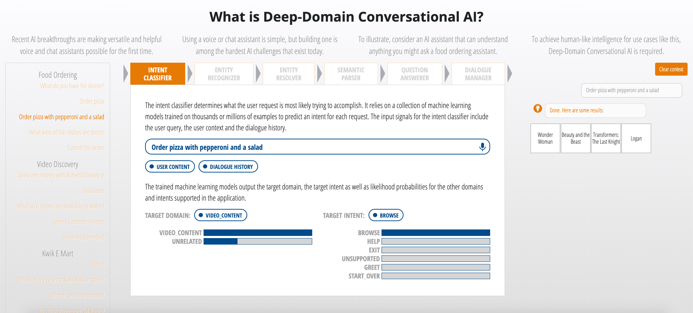

# Mindmeld UI

This is a React application that can be run along with any of the blueprints, or any `mindmeld` based app.

We recommend running this app with a recent version of Chrome to guarantee access to the ASR engine.

## Quick Start

You can run this app by following the next steps.

### 1. Install the dependencies

In order to run the app, you need to install it's dependencies. You can simply run:

```
npm install
```

You can also use yarn:

```
yarn install
```

### 2. Run the web app

To run the web app simply do:

```
npm start
```

You can also use yarn:

```
yarn start
```

### 3. Setup configurations (Optional)

At the root directory, you can add a `.env` file that includes your configurations. This file should look like this:

```
REACT_APP_GOOGLE_KEY = <YOUR_GOOGLE_KEY> # Set this if you want to use Google Cloud's Speech API (as opposed to Chromes native ASR).
REACT_APP_MAX_ALTERNATIVES = <MAX_ALTERNATIVES> # Set this if you want to control how many responses you get from the ASR.
REACT_APP_MINDMELD_URL = <MINDMELD_URL> # Set this if you need to point the UI to point the UI to a URL different than the default 'http://127.0.0.1:7150/parse'
```

### 4. Navigate the app
First, you will need to run the Mindmeld app. If you are developing locally, you can do:

```
python -m [app-name] run`
```



On the left, you can select a query from a predefined list of queries from our sample blueprints. You can type the query directly into the input box. You can also click on the microphone button for sound input using automatic speech recognition.

After the query is sent to the MindMeld application, the Web UI receives a response and displays each component visually. You can navigate to each component (such as Intent Classifier) to learn more about them.